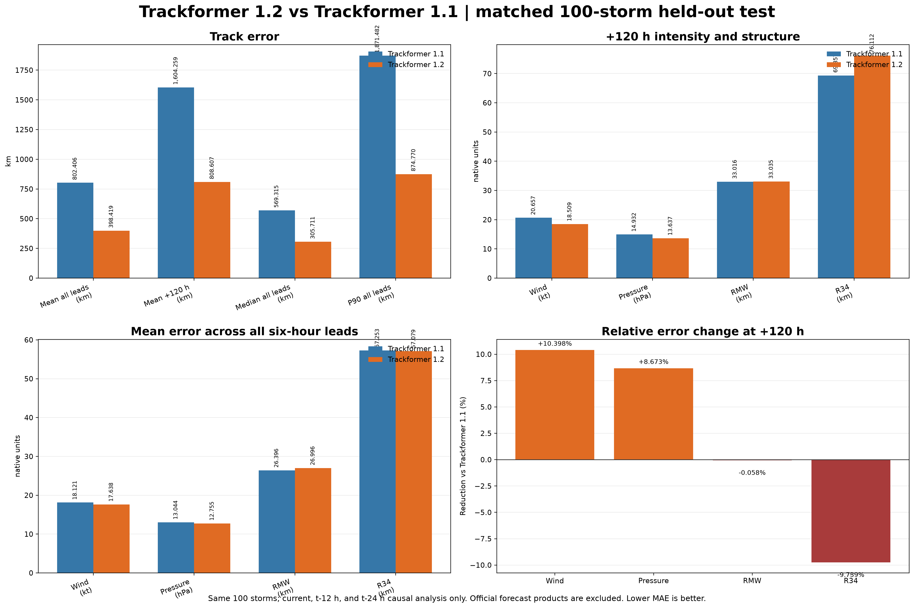
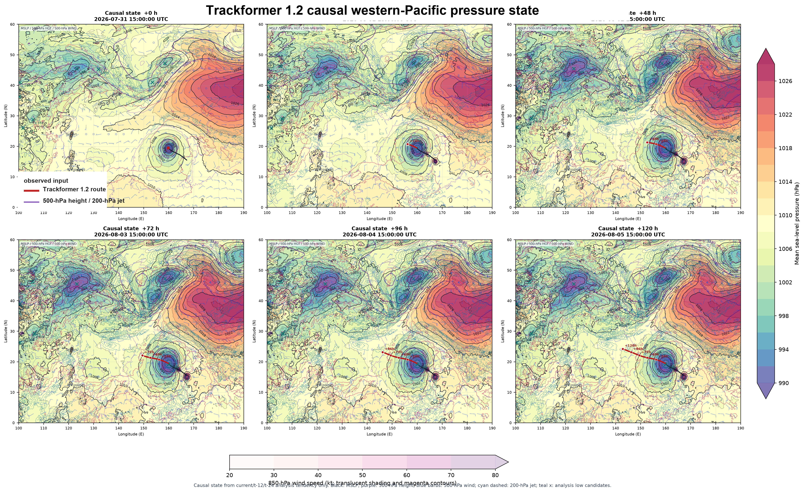

# Trackformer 1.2

Trackformer 1.2 is an experimental, causal western-Pacific tropical-cyclone
forecasting model. It forecasts storm motion, maximum sustained wind, central
pressure, radius of maximum wind, and R34/R50/R64 wind radii over six-hour
leads through +120 h.

This is a research release, not an operational warning system. Do not use it
for evacuation, aviation, maritime, emergency-management, or other
safety-critical decisions.

## Release Highlights

- A whole western-Pacific route state with land, coastline, terrain, and
  ocean-context features.
- A causal intensity and structure head for maximum wind, pressure, RMW, and
  quadrant wind radii.
- Current and lagged atmospheric analysis plus SST context, nearby-storm
  context, and static geography.
- Validation-gated calibration and storm-disjoint chronological evaluation.
- Native PyTorch and joblib artifacts in a GitHub Release and the Hugging Face
  model repository.

The public release name is **Trackformer 1.2**. The internal experiment history
is intentionally not used as the public product name.

## Availability

- [GitHub Release: Trackformer 1.2](https://github.com/yu314-coder/typhoon-predict/releases/tag/trackformer-1.2)
- [Hugging Face model repository](https://huggingface.co/euler314/typhoon-predict)
- [Live interactive demo](https://yu314-coder.github.io/typhoon-tracks.html)

The main branch contains source and documentation. The model weights are
distributed as the release archive rather than committed into the Git history.

## What Changed

Trackformer 1.2 keeps the causal route design and adds a promoted
land/ocean-context intensity candidate. The structure head uses pooled
log-radius groups, lead-wise residual calibration, non-negative radius
constraints, and a validation-selected ocean-availability gate. The route and
intensity components are packaged together so the same release can expose the
forecast track and the surrounding storm structure.

The release deliberately excludes the rejected exploratory multi-variant
ensemble. It is not used to select a favorable result after looking at the
test cases.

## Data Boundary

The model input at forecast issue time is limited to information available at
that time or earlier:

- observed IBTrACS history;
- route atmospheric analysis at t0, -6 h, and -12 h;
- storm-centred atmospheric patches at t0, -12 h, and -24 h;
- current and lagged sea-surface-temperature summaries;
- causal nearby-storm and basin/global pressure context;
- static land/sea, coastline, terrain, land-cover, and location features.

It does **not** use JMA, JTWC, ECMWF, GFS, GEFS, or another agency's forecast
track or positive-lead weather field as an input. Later observations and
best-track labels are used only after the forecast is frozen for verification.

## Inputs

Trackformer 1.2 keeps the public causal input families used by Trackformer 1.1;
the route context is expanded across the western Pacific and includes the
static land/ocean features needed near coastlines. The public tensor contract
is:

| Input | Shape or content | Boundary |
|---|---|---|
| Observed track and intensity history | `9 x 54` track window | issue time and earlier |
| Current storm-centred analysis | `4 x 17 x 17` | issue-time analysis |
| Older analysis context | `8 x 17 x 17` | -12 h and -24 h analysis |
| Whole-Pacific route state | `3 x 7 x 25 x 61` | route analysis at `t0`, `t-6 h`, `t-12 h` |
| SST, nearby systems, and pressure context | causal summaries and spatial features | issue time and earlier |
| Geography | land/sea, coastline, terrain, land-cover, and location features | static |

The data families are observations, analyses, reanalysis summaries, and static
geography. They are not agency forecast products. Missing radius labels are
masked rather than converted to zero.

## Causal Input Contract

This section is the authoritative timing and coordinate contract. The names
`t1` and `t2` are not used in the public API because they hid the actual lag.

### Route Field

`prepare_route_field(slp, hgt500)` expects three analysis frames in exactly
this order: **t0, t-6 h, t-12 h**. It returns six channels in paired order:

```text
[SLP_t0, H500_t0, SLP_t-6, H500_t-6, SLP_t-12, H500_t-12]
```

The trained `[25, 61]` grid is not `100–190E` at 1.5 degrees. It is:

```text
latitude:  60.0, 57.5, ..., 0.0 N       (25 points, descending)
longitude: 90.0, 92.5, ..., 240.0 E      (61 points, ascending)
```

The exported constants `ROUTE_LATITUDES` and `ROUTE_LONGITUDES` contain these
vectors. The route field is an analysis-only input: use the latest analysis
available at the issue time and its two six-hour predecessors, never a
positive-lead forecast field.

### System Features

`build_route_system_features` expects the seven channels in this exact order:

```text
[H500, U850, V850, U500, V500, U200, V200]
```

The same order is available as `ROUTE_SYSTEM_CHANNELS`. If named arrays are
used, pass `channel_names=ROUTE_SYSTEM_CHANNELS`; the constructor raises an
error for a permutation instead of silently assigning the wrong Pacific-High
or steering descriptors.

### Structure and Intensity History

The storm-centred structure patches and ocean summaries use a separate timing
contract: **t0, t-12 h, t-24 h**. This is why the route field and structure
patches have different lag spacing. The `causal_features` vector combines
those patches with the issue-time-or-earlier track, nearby systems, basin and
global analysis context, SST/ocean summaries, and static geography.

### Static Geography Source

The eight published geography channels are derived from the packaged static
land/sea map, not downloaded as a forecast. The source is **Natural Earth 50m
land plus ESA WorldCover 10m 2021 v200**. The route-query map is sampled on a
global **0.25-degree grid** (`-60..70N`, `0..360E`, shape `521 x 1441`), with
WorldCover sampled remotely at `48 x 48` per 3 x 3 degree tile before the
derived coastline, multiscale land-fraction, land-buffer, and local-variance
features are computed. `land_fraction_75/150/300km` are derived features from
this same static map; they are not future weather fields.

## Outputs

For each of 20 six-hour leads from +6 h through +120 h, the model returns:

| Output | Shape or unit |
|---|---|
| Track latitude and longitude | `20 x 2`, degrees |
| Maximum sustained wind | knots, 1-minute estimate |
| Central pressure | hPa |
| Radius of maximum wind | kilometres |
| R34, R50, and R64 | four quadrant radii in kilometres |
| Pressure-state route fields | whole western-Pacific grid with pressure contours and steering context |

Radius outputs are non-negative and the structure head enforces R34 >= R50 >=
R64 for each quadrant.

## Held-Out Comparison

The canonical comparison uses the same 100 common storms, the same earliest
available test initialization per storm, the same +6 h through +120 h leads,
and the same issue-time causal boundary. The split remains chronological and
storm-disjoint:

- training: storms through 2015;
- validation: storms from 2016 through 2019;
- test: storms from 2020 onward, held out until scoring.

The earlier README comparison mixed a different release-manifest aggregate with
this matched-storm benchmark. That is why it appeared to show a win in every
category. The chart below is now the canonical comparison; lower error is
better and all values come from the matched 100-storm evaluation.



The source values and input policy are recorded in
[paper/trackformer_1_2_vs_1_1_matched100_metrics.json](paper/trackformer_1_2_vs_1_1_matched100_metrics.json).

| Metric | Trackformer 1.1 | Trackformer 1.2 | Better in this benchmark |
|---|---:|---:|---|
| Mean track error, all leads (km) | 802.406 | 398.419 | Trackformer 1.2 |
| Mean track error, +120 h (km) | 1,604.259 | 808.607 | Trackformer 1.2 |
| Wind MAE, +120 h (kt) | 20.657 | 18.509 | Trackformer 1.2 |
| Pressure MAE, +120 h (hPa) | 14.932 | 13.637 | Trackformer 1.2 |
| RMW MAE, +120 h (km) | 33.016 | 33.035 | Trackformer 1.1, marginally |
| R34 MAE, +120 h (km) | 69.357 | 76.112 | Trackformer 1.1 |
| Wind MAE, all leads (kt) | 18.121 | 17.638 | Trackformer 1.2 |
| Pressure MAE, all leads (hPa) | 13.044 | 12.755 | Trackformer 1.2 |
| RMW MAE, all leads (km) | 26.396 | 26.996 | Trackformer 1.1 |
| R34 MAE, all leads (km) | 57.253 | 57.079 | Trackformer 1.2 |

This benchmark supports a strong track improvement and lower wind/pressure
error. It does **not** support the claim that Trackformer 1.2 is better on
every radius metric; RMW remains slightly worse and +120 h R34 is worse. Those
limitations are kept visible instead of selecting a more favorable cohort.

## Pressure-Map Diagnostic

The route output is a whole-western-Pacific pressure-state diagnostic with
MSLP contours, 500-hPa height, wind context, and the causal route. It is a
model diagnostic, not an official forecast overlay.



The image is included to show the spatial output format. The quantitative
comparison above, not a single case map, is the model benchmark.

## Release-Candidate Metrics

For completeness, the released land/ocean-context head was also compared with
its frozen causal baseline on 9,994 untouched test windows at +120 h. Lower is
better.

| Metric at +120 h | Frozen baseline | Trackformer 1.2 candidate |
|---|---:|---:|
| Maximum wind MAE (kt) | 19.876 | 19.618 |
| Central pressure MAE (hPa) | 13.634 | 13.519 |
| Mean radius MAE (km) | 28.952 | 28.944 |
| R34 MAE (km) | 46.672 | 46.672 |
| R50 MAE (km) | 25.417 | 25.417 |
| R64 MAE (km) | 14.767 | 14.742 |

The candidate improves maximum wind, pressure, mean radius, and R64 at +120 h,
while R34 and R50 are unchanged at the displayed precision. This is a separate
candidate-versus-baseline diagnostic and must not be substituted for the
matched 1.1 comparison above.

## Weight Bundle

The release archive contains:

```text
models/trackformer_1_2/
  manifest.json
  trackformer_1_2_route_seed0.pt
  trackformer_1_2_route_seed1.pt
  trackformer_1_2_intensity_seed0.pt
  trackformer_1_2_intensity_seed1.pt
  trackformer_1_2_ocean_structure.joblib
  trackformer_1_2_feature_stats.npz
  trackformer_1_2_route_context_stats.npz
  trackformer_1_2_track_stats.npz
  trackformer_1_2_system_context_stats.npz
```

The bundle uses native PyTorch checkpoints, NumPy statistics, and a joblib
calibration artifact. GGUF is not an appropriate interchange format for this
CNN/Transformer weather model.

Download the archive from the [Trackformer 1.2 release](https://github.com/yu314-coder/typhoon-predict/releases/tag/trackformer-1.2),
verify its SHA-256 value shown in the release notes, and extract it outside the
Git checkout.

## Python Inference

The repository includes a checkpoint-compatible inference module in
[`trackformer_1_2.py`](trackformer_1_2.py). It loads both released neural
seeds and averages them as one Trackformer 1.2 model. The same module now
publishes the feature constructors used to build the tensor contracts, rather
than requiring callers to reverse-engineer the training code. Install the
runtime dependencies with:

```bash
python -m pip install -r requirements.txt
```

Load from an extracted GitHub Release bundle:

```python
import numpy as np
from trackformer_1_2 import (
    Trackformer12, build_base_position, build_route_context,
    build_nearby_interaction_features, build_route_geography_features,
    build_route_kinematic_features, build_route_system_features,
    build_synoptic_features, local_position_to_latlon, prepare_route_field,
)

model = Trackformer12.from_pretrained(
    "/path/to/trackformer_1_2/models/trackformer_1_2",
    device="cpu",  # use "mps" on Apple Silicon or "cuda" on NVIDIA
)

# These arrays must be constructed from issue-time/current and earlier data.
# build_route_context returns the raw 647-feature vector; the loader applies
# the released train-only route normalization automatically.
context = build_route_context(
    synoptic_features, system_features, interaction_features,
    geography_features, kinematic_features, base_route_100km,
)
base_position = build_base_position(base_route_100km)
route = model.predict_route(field, context, base_position)
intensity = model.predict_intensity(causal_features, anchor_structure)

latitude, longitude = local_position_to_latlon(
    route["position_100km"], issue_latitude, issue_longitude
)
```

`Trackformer12.from_pretrained()` can also download the same files from the
[Hugging Face model repository](https://huggingface.co/euler314/typhoon-predict)
when `model_root` is omitted:

```python
from trackformer_1_2 import Trackformer12
model = Trackformer12.from_pretrained(device="cuda")
```

The exact public tensor contract is:

| API input | Shape | Meaning |
|---|---:|---|
| `field` | `[B, 6, 25, 61]` | normalized SLP/H500 grids ordered as `t0,-6 h,-12 h` pairs |
| `context` | `[B, 647]` | causal whole-Pacific context used by the released route checkpoint |
| `base_position` | `[B, 20, 2]` | cumulative local 100-km displacement before route correction |
| `causal_features` | `[B, 1020]` | exact pre-residual causal structure features |
| `anchor_structure` | `[B, 20, 15]` | frozen causal anchor: vmax, pressure, RMW, R34/R50/R64 quadrants |
| `ocean_features` | `[B, 66]` | current/-12 h/-24 h OHC/D26/D20 summary for the optional calibration |

### Published Feature Constructors

The constructors below are the supported bridge from causal source arrays to
the tensor contract. Route analysis frames are `t0, t-6 h, t-12 h`; structure
patches and ocean summaries are `t0, t-12 h, t-24 h`; and labels after the
issue time are never accepted as inputs.

| Constructor | Output | Purpose |
|---|---:|---|
| `prepare_route_field(slp, hgt500)` | `[B,6,25,61]` | normalize physical PRMSL/H500 analysis grids |
| `build_synoptic_features(...)` | `[B,270]` | causal low-center and 500-hPa ridge descriptors |
| `build_route_system_features(...)` | `[B,46]` | causal Pacific-High, steering, and local analysis context |
| `build_nearby_interaction_features(...)` | `[B,16]` | causal nearby observed-storm interaction context |
| `build_route_geography_features(...)` | `[B,224]` | land, coast, buffer, and terrain values along a route |
| `build_route_kinematic_features(...)` | `[B,11]` | issue-time position, heading, speed, turn, and acceleration |
| `build_route_context(...)` | `[B,647]` | concatenate the exact route context |
| `build_causal_structure_features(...)` | `[B,1020]` | construct the full wind/pressure/RMW/radius feature vector |
| `build_intensity_context_features(...)` | `[B,183]` | concatenate basin, nearby-system, and global context |
| `build_ocean_features(summary)` | `[B,66]` | flatten current/-12 h/-24 h 22-value ocean summaries |
| `build_terrain_samples(...)` | `[B,168]` | six causal land/sea samples used by structure |

The model bundle also contains `trackformer_1_2_route_context_stats.npz`,
`trackformer_1_2_track_stats.npz`, and
`trackformer_1_2_system_context_stats.npz`. `Trackformer12.predict_route`
applies the route normalization automatically when passed the raw output of
`build_route_context`.

For example, the route-side construction is:

```python
stats = model.system_context_stats
system = build_route_system_features(
    ncep_current_7ch, ncep_previous_7ch, ncep_lat, ncep_lon,
    issue_latitude, issue_longitude, feature_mean=stats["system_mean"],
    feature_std=stats["system_std"],
    channel_names=("hgt500", "uwnd850", "vwnd850", "uwnd500", "vwnd500", "uwnd200", "vwnd200"),
)
interaction = build_nearby_interaction_features(
    nearby_latitude, nearby_longitude, nearby_vmax, nearby_age_hours,
    issue_latitude, issue_longitude,
    feature_mean=stats["interaction_mean"],
    feature_std=stats["interaction_std"],
)
base_position = build_base_position(base_route_100km)
synoptic = build_synoptic_features(
    slp_t0_tminus6_tminus12, h500_t0_tminus6_tminus12,
    pressure_lat, pressure_lon, issue_latitude, issue_longitude,
)
geography = build_route_geography_features(
    base_position, issue_latitude, issue_longitude,
    terrain_lat, terrain_lon, terrain_features, terrain_feature_names,
)
kinematic = build_route_kinematic_features(
    current_motion_100km, previous_motion_100km,
    issue_latitude, issue_longitude,
)
context = build_route_context(
    synoptic, system, interaction, geography, kinematic, base_route_100km,
)
route = model.predict_route(field, context, base_position)
```

For intensity, call `build_causal_structure_features(...)` with the three
decoded DLM4 analysis patches, three SST patches, the six-point terrain sample,
and the 183-feature result of `build_intensity_context_features(...)`. Pass
`model.track_mean` and `model.track_std` so the physical observed track is
encoded exactly. Then call `model.predict_intensity(features, anchor)`. The
`build_causal_anchor_structure(observed_structure)` helper is a causal
persistence/trend fallback only; it is not the frozen incumbent anchor and
must be labeled as such in a benchmark.

### Frozen Upstream Inputs

Two inputs are frozen upstream members rather than standalone public neural
heads: the route model's incumbent route and the intensity model's 20-lead
structure anchor. The exact incumbent `base_position` arrays are row-aligned
to the private training/evaluation issue-window archive, so there is no
universal public dump that can be safely applied to an arbitrary storm. If an
issue packet contains the exact causal array, pass it directly. Otherwise,
`build_kinematic_base_position` and `build_causal_anchor_structure` provide
explicit persistence/trend fallbacks. These fallbacks do not reproduce the
incumbent members and must be labeled as fallback inputs in any benchmark;
they are not a way to select a favorable result.

Use `prepare_route_field(slp, hgt500, ...)` when the three SLP and 500-hPa
height grids are still in physical units. Use
`examples/predict_trackformer_1_2.py` to run an `.npz` issue packet:

```bash
python examples/predict_trackformer_1_2.py \
  --input issue_packet.npz \
  --output forecast.npz \
  --model-root /path/to/models/trackformer_1_2
```

The optional `predict_ocean_structure(...)` method returns the separately
validated causal OHC/D26/D20 calibration around the frozen 1.2.26 anchor. It
is intentionally returned as a separate result and is not silently stacked
on the neural intensity residual head; stacking them would be a new,
unvalidated model. The wrapper does not include a raw-data downloader because
the released feature tensors require source-specific preprocessing and
quality/availability masks. This keeps the issue-time boundary auditable and
prevents future or official forecast fields from entering by accident.

## Historical Releases

[Trackformer 1.1](https://github.com/yu314-coder/typhoon-predict/releases/tag/trackformer-1.1)
remains available as a historical baseline. It is not mixed into the
Trackformer 1.2 weights or ensemble.

## Limitations

Forecast error varies by storm, basin, analysis source, storm structure, land
interaction, and missing-data pattern. Radius labels are incomplete for some
historical storms and are masked during training. The model does not provide
calibrated operational warnings. Use official meteorological agencies for
real-world forecasts and warnings.

## License

Code and compact artifacts are released under the repository MIT license.
Upstream datasets remain subject to their own terms and attribution
requirements.
