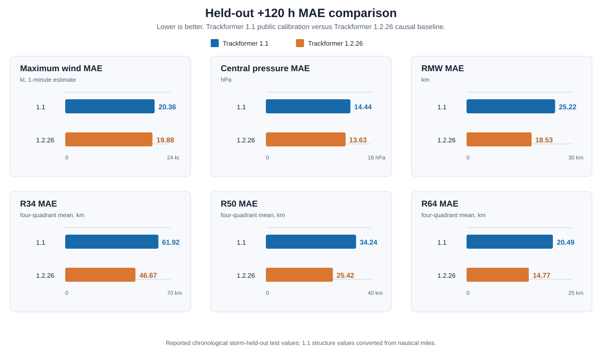

# Trackformer 1.1

## Model Card

Trackformer 1.1 is an experimental causal tropical-cyclone forecasting model
for the western Pacific. It predicts storm motion, maximum sustained wind,
central pressure, radius of maximum wind, and four-quadrant R34/R50/R64 wind
radii over 20 six-hour leads from +6 h through +120 h.

It is a research model, not an operational warning system. Do not use it for
evacuation, aviation, maritime, emergency-management, or other safety-critical
decisions.

## Release

The frozen Trackformer 1.1 checkpoints are attached to the same repository as a
GitHub Release:

[Download Trackformer 1.1](https://github.com/yu314-coder/typhoon-predict/releases/tag/trackformer-1.1)

The release archive contains the native PyTorch checkpoints, normalization
statistics, calibration state, and the inference manifest. The main branch
contains source code and model documentation; it intentionally contains no
generated HTML forecast pages.

## What The Model Predicts

| Output | Shape or unit |
|---|---|
| Track latitude and longitude | 20 future six-hour leads |
| Maximum sustained wind | knots, 1-minute estimate |
| Central pressure | hPa |
| Radius of maximum wind | kilometres at the public output boundary |
| R34/R50/R64 wind radii | kilometres, four quadrants each |

The native structure tensors use nautical miles. The public loader converts
RMW and wind radii to kilometres. Radius outputs are non-negative and ordered
as R34 >= R50 >= R64 for each quadrant.

## Architecture

Trackformer 1.1 is a regional analysis-state route plus a spatial/temporal
structure ensemble.

1. The route module reads a full western-Pacific analysis domain and builds
   causal steering views from 850 hPa, 500 hPa, 200 hPa, and 500 hPa height
   fields.
2. A weighted route ensemble combines inner-flow, deep-layer, ridge, trough,
   and jet-level steering views.
3. The intensity head reads the nine-step observed track window and the
   current four-channel storm-centred analysis patch.
4. Three intensity experts estimate maximum wind and central pressure.
5. Three structure experts estimate RMW and the twelve quadrant radii.
6. Three temporal experts read the current and older analysis patches and
   provide a validation-gated residual adjustment.
7. Calibration is fitted on the validation split and applied without changing
   the causal input boundary.

The public input contract is:

- track window: 9 x 54;
- current intensity field: 4 x 17 x 17;
- optional older analysis fields: 8 x 17 x 17;
- route fields: 3 snapshots x 7 channels x latitude x longitude.

## Data And Training

### Training sources

| Source | Use |
|---|---|
| IBTrACS best-track history | Observed track history, intensity/structure labels, and later verification |
| Atmospheric analysis or reanalysis | Current, -12 h, and -24 h pressure, height, and wind state |
| SST summaries | Current and past sea-surface-temperature context |
| Static geography | Land/sea, terrain, land-cover, coastline, and location features |

The model uses only information available at the forecast issue time or
earlier. It does not use JMA, JTWC, ECMWF, GFS, GEFS, or any other agency's
forecast track or positive-lead weather field as an input. Future observations
are used only after the forecast is frozen for scoring.

The split is storm-disjoint and chronological:

- training: storms whose first year is through 2015;
- validation: storms whose first year is 2016 through 2019;
- test: storms whose first year is 2020 onward.

Normalization statistics, calibration, and checkpoint selection use training
and validation data only. The test split remains untouched until evaluation.
Missing structure labels are masked; missing radii are never treated as zero
observations.

### Training procedure

The model is trained with PyTorch using:

- a lead-weighted masked Huber/Smooth L1 objective;
- separate kinematic and thermodynamic feature paths;
- temporal curve consistency loss;
- non-negative radius constraints;
- R34/R50/R64 containment penalty;
- validation-selected calibration and ensemble blending;
- three seeds for the intensity, structure, and temporal expert groups.

The release contains 3 primary intensity checkpoints, 3 structure checkpoints,
and 3 temporal checkpoints. Training is reproducible from the source modules
and the compact array contracts; raw weather archives are not bundled.

## Held-Out Comparison

The chart below compares the public Trackformer 1.1 calibration with the
Trackformer 1.2.26 causal physics-calibrated baseline at +120 h. Lower error is
better.

| Metric at +120 h | Trackformer 1.1 | Trackformer 1.2.26 |
|---|---:|---:|
| Maximum wind MAE (kt) | 20.36 | 19.88 |
| Central pressure MAE (hPa) | 14.44 | 13.63 |
| RMW MAE (km) | 25.22 | 18.53 |
| R34 MAE (km) | 61.92 | 46.67 |
| R50 MAE (km) | 34.24 | 25.42 |
| R64 MAE (km) | 20.49 | 14.77 |

Trackformer 1.1 values are from the released calibration manifest on its
chronological storm-held-out test split. Its structure errors are reported in
native nautical miles and converted with 1 nautical mile = 1.852 kilometres.
Trackformer 1.2.26 values are from the causal physics-v4 baseline manifest,
including 9,994 untouched test windows. The comparison is a diagnostic
research comparison; it is not an operational skill claim.

The source values are recorded in
[paper/trackformer_1_1_vs_1_2_26_metrics.json](paper/trackformer_1_1_vs_1_2_26_metrics.json).

## Reproducible Inference

Install the dependencies:

~~~bash
python -m pip install -r requirements.txt
~~~

Download the Trackformer 1.1 release archive, extract it at the repository
root, and use:

- trackformer_1_1.py for the public loader;
- trackformer_1_1_route.py for the causal pressure-state route;
- trackformer_1_1_intensity.py for intensity and wind structure;
- trackformer_1_1_temporal.py for the temporal expert architecture.

The supported checkpoint format is native PyTorch. GGUF is not an appropriate
interchange format for this CNN/Transformer weather model.

## Limitations

Forecast error varies by storm, basin, analysis source, storm structure, land
interaction, and data availability. The model does not provide calibrated
operational warnings. Use official meteorological agencies for real-world
forecasts and warnings.

## License

Code and compact artifacts are released under the repository MIT license.
Upstream datasets remain subject to their own terms and attribution
requirements.
