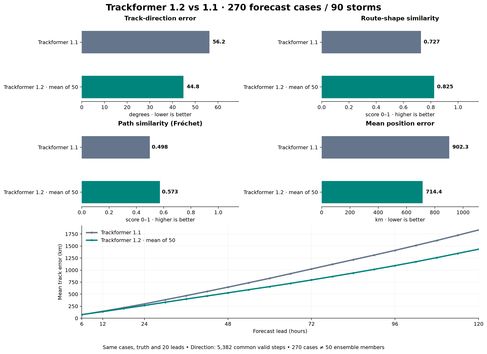
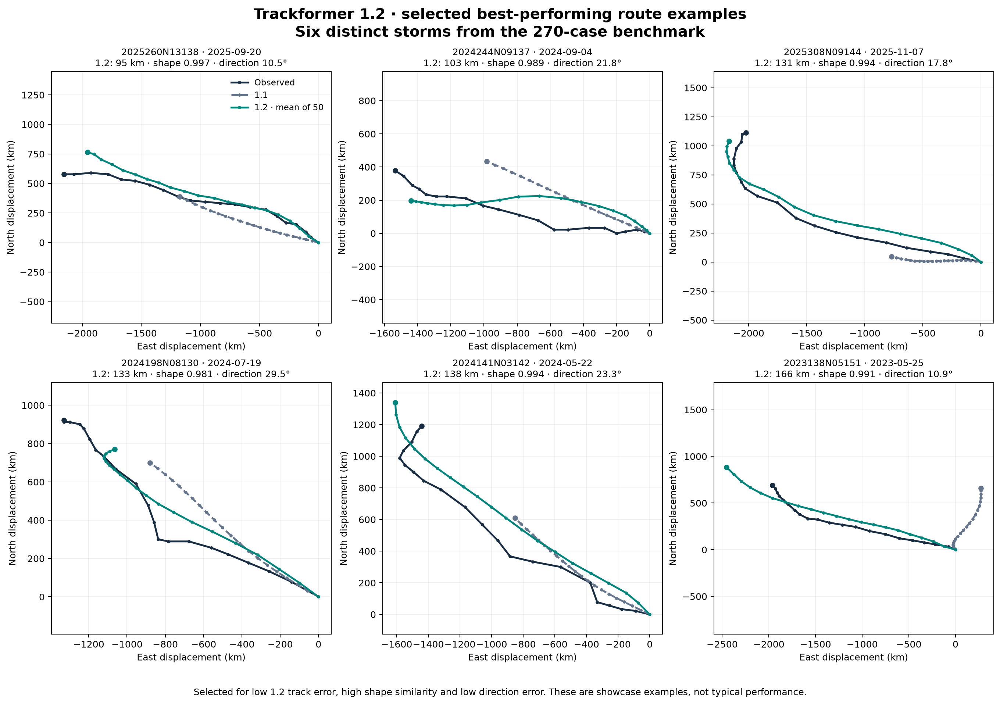
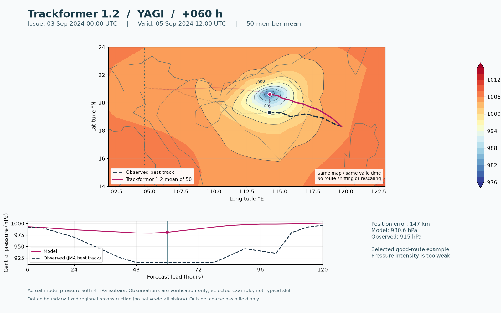

# Trackformer 1.2

Trackformer 1.2 is a **research-only Western Pacific tropical-cyclone forecast model**. It evolves a sea-level-pressure (MSLP) field and a moving storm-centred pressure core every six hours through +120 h. A track and central-pressure estimate are extracted from the evolving core, not independently drawn on top of a pressure image. The prior [Trackformer 1.1 release](https://github.com/yu314-coder/typhoon-predict/releases/tag/trackformer-1.1) remains available and unchanged.

**Not an operational warning system.** Do not use these forecasts for evacuation, aviation, maritime, or other safety-critical decisions. The public 1.2 name identifies one selected development checkpoint; a genuinely untouched storm-level holdout has not yet established generalization.

## What changed from 1.1

| | Trackformer 1.1 | Trackformer 1.2 |
| --- | --- | --- |
| Main representation | Observed history and weather features to track/intensity/structure outputs | Autoregressive basin MSLP plus storm-centred moving pressure core |
| Six-hour outputs | Track, maximum wind, central pressure, RMW, R34/R50/R64 | Track, central pressure, basin and regional MSLP; auxiliary maximum-wind scalar |
| Pressure-map capability | No native evolving MSLP forecast field in released model | Model-generated MSLP fields at every lead |
| Forecast horizon | +6 to +120 h | +6 to +120 h |
| Meaning of “50-member mean” | Not part of the 1.1 comparison | Same weights on 50 distinct, smoothly perturbed **causal input histories**; separately averaged routes, pressures and common-grid fields. Not 50 trained networks or learned latent members. |

The two models use different input pipelines. A direct chart is therefore a *forecast-output comparison on common cases and leads*, not a controlled architecture ablation.

## How the 1.2 model works

1. **Causal initialization.** Nine six-hour analyses ending at issue time provide eight basin channels on a 25×33 grid: MSLP, 500-hPa height, and 850/500/200-hPa winds. Where stored native detail exists, nine 121×121 regional MSLP patches supplement the coarse field. Static geography, current observed centre, recent motion, current intensity and masks are issue-time inputs. A compact pressure correction initializes the regional core from current observations; it is a reconstruction, not future weather.
2. **Environmental transport.** A convolutional recurrent state evolves the basin field. Estimated steering flow and a departure grid advect it, with learned pressure tendencies. Two pooled spatial scales feed a two-block transformer encoder; cross-attention conditions the environmental memory. Its output starts at zero so the added component initially matches its warm-start baseline.
3. **Moving pressure core.** A 65×65 storm-centred internal grid at approximately 20-km spacing moves with the storm. Its pressure anomaly is transported relative to the environmental flow and updated by learned tendencies. The displayed 121×121 regional field is a resampled composite; the moving core is authoritative for centre and central pressure.
4. **Coupled outputs.** A local low-pressure association within 300 km identifies the forecast centre. Central pressure is sampled from the predicted core **at that centre**. Maximum wind is an auxiliary scalar, not a resolved wind field or wind radii.
5. **Autoregression.** The transition runs 20 times for +6, +12, …, +120 h. Training combines basin-field, regional/core-field, track, central-pressure and auxiliary-wind losses, plus masked pressure-change and displacement losses. Future truth is a training/evaluation target only, never an inference input.

The implementation is in [`models/trackformer_1_2_field/`](models/trackformer_1_2_field/); its [`manifest.json`](models/trackformer_1_2_field/manifest.json) records exact grids, normalization, architecture and SHA-256 provenance. Internally the selected checkpoint came from experiment version `1.2.73`, epoch 4. The public model is **Trackformer 1.2**; that internal identifier is retained only for reproducibility.

## 270-case comparison: direction, route shape and position

This comparison uses **270 forecast cases from 90 storms**, with the same issue rows, observed routes and 20 six-hour leads through +120 h. The number 270 counts forecast cases. The 1.2 prediction for each case is a **mean of 50 causal input-perturbation members**; 1.1 uses its archived causal route pipeline.

| Metric | 1.1 | 1.2 · mean of 50 | Preferred |
| --- | ---: | ---: | --- |
| Mean six-hour direction error | 56.22° | **44.82°** | Lower |
| Route-shape similarity | 0.7273 | **0.8249** | Higher |
| Path similarity (Fréchet) | 0.4983 | **0.5727** | Higher |
| Mean track error, +6 to +120 h | 902.3 km | **714.4 km** | Lower |
| Track error at +120 h | 1,833.2 km | **1,433.4 km** | Lower |

**What “similarity” means:** direction error compares the heading of each six-hour step, on 5,382 common valid case-leads where truth and both models move more than 1 km. Shape similarity compares the centred route curves after removing overall scale, while preserving their orientation; a score of 1 means identical shape under that comparison. Path similarity uses Fréchet distance and the observed route length, so it also responds to geographic displacement. These scores measure different aspects of the forecast and are reported separately.

**Actual route alignment is the goal:** predicted and observed positions should coincide geographically at the same valid times. A high centred-shape score alone does **not** demonstrate that alignment; a displaced forecast can have the right shape and still be wrong. Position error and the unshifted route overlay must therefore be read alongside the shape score.

The saved 1.1 archive had a coordinate-label bug: its `v11_local` array held absolute latitude/longitude, while the original scorer interpreted it as east/north kilometres. The new comparison converts those coordinates to the same local projection used by 1.2 and verifies a round trip back to the original coordinates. **The old 1,036.3 km score is superseded by 902.3 km.** Original forecast archives are preserved. The [published metrics](evaluation/trackformer_1_2_vs_1_1_270_metrics.json), small plot-data arrays and [reproduction script](release_tools/plot_release_270.py) record the correction.

### What the routes look like

These are **six selected best-performing examples from six distinct storms**, not a representative sample. Among in-domain cases with at least 300 km of observed travel, shape similarity ≥0.90 and direction error ≤30° on at least 18 common valid leads, we select the lowest 1.2 mean track errors, with one case per storm. Every curve starts at the same issue-time origin. The [selection manifest and all 270 case scores](evaluation/trackformer_1_2_showcase_selection.json) make the choice auditable; the aggregate bars above still include every case, including poor forecasts.

The 1.2 mean has better aggregate direction, shape and position scores on this previously inspected development cohort. That does not establish an overall win on every storm or pressure metric. A same-270 1.1 central-pressure prediction array was not verified in these route artifacts, so it is not assigned a pressure-error bar. The separate 1.2 report gives 15.73 hPa central-pressure MAE and 2.54 hPa area-weighted regional MSLP MAE. TIP remains a separate diagnostic: its pressure error was worse for 1.2 (30.7 vs 20.1 hPa). See [metric definitions and limitations](docs/trackformer_1_2_evaluation.md).

### Expanded daily-issue benchmark: 270 distinct typhoons

A new **1,473-case / 270-storm** benchmark is in progress; it is not the completed 270-case result above. Each storm contributes at most one forecast per UTC day, through +120 h. Daily errors are averaged within each storm, then the 270 storm scores receive equal weight. Selection was frozen before new inference, without filtering on forecast quality. See the [protocol](docs/daily_storm_benchmark.md) and [frozen cohort](evaluation/release_data/daily_storm_cohort.json). Results are pending; no improvement is claimed from the partial run.

## Yagi pressure forecast — MP4

**[Play or download the Yagi MP4](https://yu314-coder.github.io/typhoon-predict/trackformer_1_2_yagi.mp4)** · 23 seconds · +6 to +120 h · **50-member mean**. Click the preview above to play it; inline video playback depends on the Markdown host.

The forecast starts **3 September 2024 at 00 UTC**. Actual saved model-generated pressure with **4 hPa isobars** is shown alongside the mean forecast route and observed best track, at matching valid times and on the same geographic map. Neither route nor field is shifted or rescaled to improve alignment. The central-pressure timeline compares the forecast to **JMA best-track pressure from IBTrACS TOKYO_PRES**, not a JMA forecast.

This deliberately selected good-route example has **114.1 km mean geographic error**, **57.2 km at +120 h**, and all 20 leads within 200 km. **Intensity is too weak: central-pressure MAE is 42.0 hPa.** Good route alignment does not imply good pressure prediction or typical performance. These geographic scores use exact observed coordinates and great-circle distances, separately from the saved local-coordinate benchmark scores above. Native-detail input history was unavailable; the regional pressure reconstruction uses 0.25° output sampling, not native resolution. Outside its dotted boundary only the saved coarse basin field is shown. [Data, source hashes and video provenance](evaluation/release_data/yagi_video.json).

### Architecture-only paper

The **[Trackformer 1.2 technical paper (PDF)](paper/trackformer.pdf)** describes only the detailed architecture and how forecasts work: input tensors, multiscale attention, recurrent basin transport, moving pressure core, centre association, physical pressure reconstruction, objectives and 50-member means. [Editable LaTeX source](paper/trackformer.tex). Benchmark results remain separate in the evaluation notes. Historical material is recoverable from Git history and the [1.1 release](https://github.com/yu314-coder/typhoon-predict/releases/tag/trackformer-1.1).

## Recent pressure forecast with isobars

The archived **Surigae forecast issued 27 September 2026 at 12:00 UTC** shows the model's regional pressure field at +6, +24 and +36 h. Thin lines are isobars every **4 hPa**, with selected labels every 12 hPa; magenta shows the forecast track and centre. Coastlines provide geographic context. These panels use the actual saved model values.

This recent example is **one deterministic forecast**, separate from the benchmark's mean of 50. Its input uses nine GFS analyses ending at 06 UTC, six hours before issue time; issue-time JMA central pressure was provided, while wind, prior motion and native regional history were unavailable. This transfer from the training data contract is experimental. The fixed regional map ends at 144°E; the selected leads keep the forecast centre inside it. The [pressure-field provenance](evaluation/release_data/surigae_provenance.json) records the input limitations and checkpoint hash.

## Get the model and run it

- [GitHub release and source](https://github.com/yu314-coder/typhoon-predict/releases/tag/trackformer-1.2)
- [Hugging Face weights and model card](https://huggingface.co/euler314/typhoon-predict)
- [Input schema and inference instructions](models/trackformer_1_2_field/README.md)

The inference-only `weights.pt` is hosted in the release/Hugging Face model folder, **not committed to GitHub source**. The manifest records its SHA-256 and the original training-checkpoint SHA-256. The three source modules are copied unchanged from the verified training implementation. Use **`models/trackformer_1_2_field/predict.py`** as the inference entry point. The withdrawn route/scalar candidate and its incompatible example have been removed from the current source tree.

Only issue-time and earlier analyses are permitted. The prediction wrapper rejects future-dated history and unexpected input keys, but cannot certify an externally built packet's data provenance. The operator must verify source timestamps and training-only normalization. The included wrapper runs one unperturbed forecast; it does not reproduce the saved 50-member mean automatically.

## Repository guide

| Folder | Contents |
| --- | --- |
| [`models/trackformer_1_2_field/`](models/trackformer_1_2_field/) | Current 1.2 model, inference wrapper and input/provenance contract |
| [`paper/`](paper/) | Current architecture-only paper: editable source and PDF |
| [`evaluation/`](evaluation/) | Benchmark charts, selected forecast previews, metrics and saved plot data |
| [`docs/`](docs/) | Evaluation protocols and published HTML/MP4 showcases |
| [`release_tools/`](release_tools/) | Reproduction scripts and weight-export utility |

The older 1.1 implementation, obsolete Colab notebook, withdrawn candidate, and superseded comparison assets are no longer mixed into the current source tree. Their history and the existing release tags remain intact; the current 1.1-versus-1.2 comparison data are retained. See the [cleanup record](docs/repository_layout.md).
