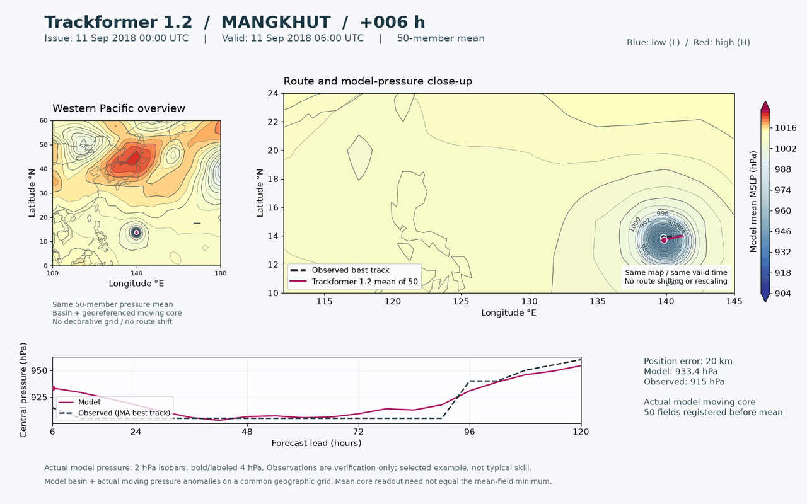
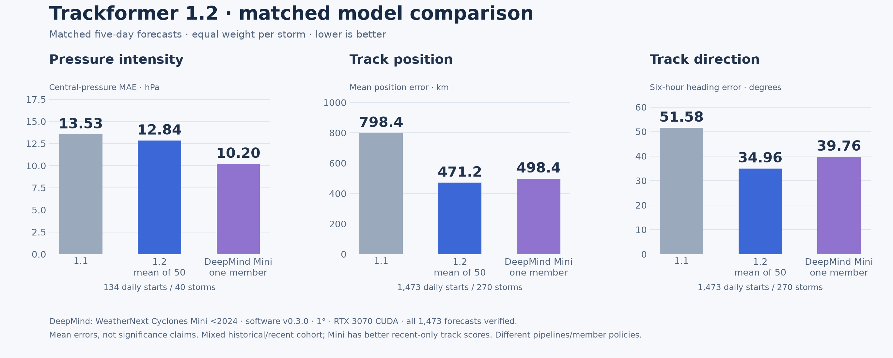
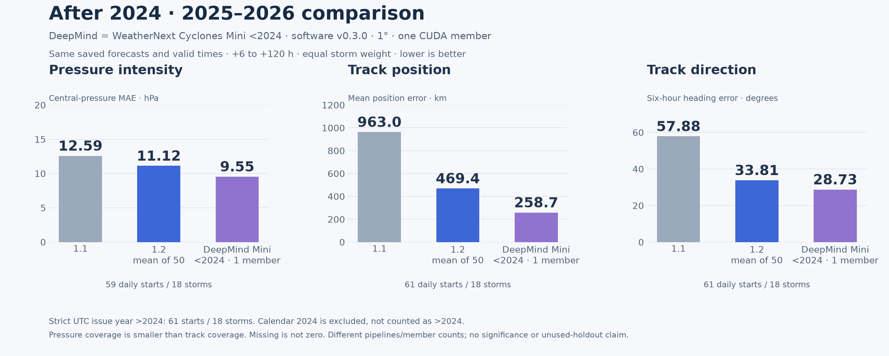
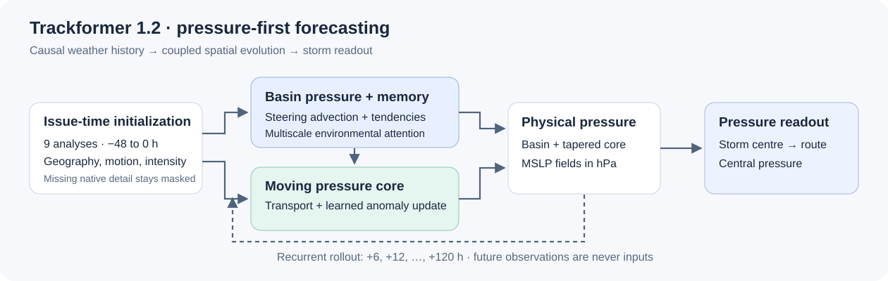

# Introducing Trackformer 1.2

Five-day typhoon forecasts built around evolving pressure fields.

Trackformer 1.2 is a research model for the **Western Pacific**. It forecasts the surrounding sea-level pressure and a moving storm core together, then reads the storm's route and central pressure from that evolving core. Forecasts advance every six hours from **+6 to +120 hours**.

[Get the model](https://github.com/yu314-coder/typhoon-predict/releases/tag/trackformer-1.2) · [Hugging Face](https://huggingface.co/euler314/typhoon-predict) · [Explore forecasts](https://trackformer-weatherlab.rudin-euler-8253.chatgpt.site/history) · [Benchmarks](https://trackformer-weatherlab.rudin-euler-8253.chatgpt.site/benchmarks) · [Paper](paper/trackformer.pdf)

## Forecasting the field, not just the route

The model connects large-scale weather with the typhoon's pressure core:

- **Pressure maps through five days.** Basin-wide conditions and the moving core evolve at every forecast step.
- **Coupled track and intensity.** The predicted pressure core determines the centre and central-pressure estimate.
- **Causal inputs.** Nine historical weather analyses end at the issue time; no future observations or official forecast routes are used as prediction inputs.
- **Inspectable outputs.** Physical pressure grids, route points, timestamps and provenance are available alongside the visual forecasts.

This is a **research release**, not an operational warning service. Follow official agencies for safety-critical decisions.

## See the forecast: Mangkhut (2018)

[](https://huggingface.co/euler314/typhoon-predict/resolve/87a6e366b42bb4cc0edc95d2c50c55fca21a2c93/docs/trackformer_1_2_mangkhut.mp4)

[Watch / download MP4](https://huggingface.co/euler314/typhoon-predict/resolve/87a6e366b42bb4cc0edc95d2c50c55fca21a2c93/docs/trackformer_1_2_mangkhut.mp4) · **11 September 2018, 00 UTC** · **50-member mean** · **20 seconds**

GitHub plays the lightweight animated GIF inline; click it for the full-quality MP4. Hugging Face provides a native video player. The GIF preserves all twenty forecast states, one second each, and loops without adding a frozen ending.

The animation shows twenty actual six-hour forecasts through +120 h. The Western Pacific overview and close-up use the same geographic mean of the model's basin and moving-core pressure fields. Blue denotes low pressure and red high pressure, with 2 hPa isobars and 4 hPa labels. Forecast and observed routes share the same coordinates and valid times—neither is shifted to make them overlap.

This selected example illustrates the model, not typical skill. Observations are verification only. The 50 members are distinct seeded perturbations of **past and issue-time inputs**, not separately trained networks. Member fields are registered geographically before averaging; the mean centre need not locate the minimum of the mean map. Display interpolation does not add resolution to the approximately 20 km core.

[Pressure arrays](evaluation/release_data/pressure_core/mangkhut/common-pressure.npz) · [Field verification](evaluation/release_data/pressure_core/mangkhut/verification.json) · [Playback verification](evaluation/release_data/mangkhut_playback_verification.json) · [More examples and diagnostics](docs/showcase_archive.md)

## What improves over 1.1

Trackformer 1.1 predicts track and scalar intensity/structure outputs. **1.2 adds evolving sea-level-pressure fields and a moving pressure core**, giving the route forecast a spatial weather representation that can be inspected on a map.

**The three-model comparison is complete and verified:** Trackformer 1.1, Trackformer 1.2 and Google's WeatherNext Cyclones Mini `<2024` were scored on **1,473 daily starts / 270 storms**. The DeepMind results below are completed RTX 3070 CUDA forecasts, not estimates or a pending run. [Completion receipt](evaluation/deepmind_daily/verification.json) · [Independent publication audit](evaluation/deepmind_daily/publication_audit.json).

**DeepMind checkpoint: `WeatherNextCyclones_Mini_<2024` · trained through 2023 · native 1° · one member · WeatherNext software v0.3.0.** This is the official Mini checkpoint, not full-sized WeatherNext or WeatherNext 3. The `<2024` suffix describes its training cutoff, not the dates being forecast. [Official model definitions](https://github.com/google-deepmind/weathernext#weathernext-cyclones-mini).

### Total · all completed forecast starts



| Development metric | 1.1 | 1.2 · mean of 50 | DeepMind Mini <2024 · one member | Shared coverage |
| --- | ---: | ---: | ---: | --- |
| Mean track error, +6 to +120 h · lower is better | 798.4 km | **471.2 km** | 498.4 km | 1,473 days / 270 storms |
| Six-hour track-direction error · lower is better | 51.58° | **34.96°** | 39.76° | 1,473 days / 270 storms |
| Central-pressure MAE · JMA · lower is better | 13.53 hPa | 12.84 hPa | **10.20 hPa** | 134 days / 40 storms |
| Centred route-shape similarity · higher is better | 0.7544 | 0.8837 | **0.9010** | 1,473 days / 270 storms |
| Pressure-curve similarity · JMA · higher is better | 0.7074 | 0.7118 | **0.8088** | 134 days / 40 storms |

Mean track error is **41.0% lower** for 1.2 on this cohort. Central-pressure error has a **small mean reduction**; the paired whole-storm 95% interval includes no improvement (−2.68 to +1.20 hPa). These results do not establish a statistically reliable pressure advantage or improvements in every output or lead.

**One storm-day is one case.** Scores average valid +6 to +120 h leads within each day, then days within each typhoon, then typhoons with equal weight. Both versions use the same frozen starts and exact valid times. Missing labels and unsupported outputs are excluded, never treated as zero errors. Track and pressure have different valid coverage, shown above.

The cohort contains 40 recent storms and 230 storms from 1980–1999. It lies outside the selected Trackformer's fitting/validation years but is a **development comparison, not a certified untouched holdout**. Different input pipelines mean this is not a controlled architecture ablation. Position, direction and route-shape similarity are separate measures; good shape alone does not prove geographical alignment.

[Full daily results](evaluation/daily_storm_final.json) · [Shared metrics and uncertainty](evaluation/released_daily/released_daily_benchmark.json) · [Forecast/hash audit](evaluation/released_daily/released_daily_verification.json) · [Daily protocol](docs/daily_storm_benchmark.md) · [Pressure, wind and radius evaluation](docs/intensity_benchmark.md)

### Completed DeepMind comparison

The reference is Google's official [WeatherNext Cyclones Mini `<2024`](https://github.com/google-deepmind/weathernext#weathernext-cyclones-mini), a **1° model trained through 2023**, run with **WeatherNext software v0.3.0**. The software version is not the checkpoint name. This is **Mini, not the full-sized WeatherNext 2/Cyclones model**.

All **1,473 daily starts / 270 storms** completed on an **NVIDIA RTX 3070 using CUDA**. Each saved forecast contains twenty exact six-hour route and native pressure-map outputs through +120 h. The returned archive's hashes, original Trackformer forecasts, common masks and equal-storm scores were independently rechecked. Mini uses one seeded member and its own causal ERA5 analyses; 1.2 uses a 50-input-member mean. No missing result is scored as zero.

The proportions below describe **benchmark coverage, not training-data composition or different DeepMind models**. All groups use the same Mini `<2024` checkpoint. **DeepMind checkpoint usage: 100% Mini `<2024`; 0% other checkpoints.** Dates refer to the forecast's UTC issue time; calendar 2024 is separate from strict `>2024`.

| Forecast issue dates | Daily starts | Share of starts | Storms | Share of storms |
| --- | ---: | ---: | ---: | ---: |
| `<2024` · 1980–1999 in this frozen cohort | 1,336 | 90.7% | 230 | 85.2% |
| Calendar 2024 | 76 | 5.2% | 22 | 8.1% |
| `>2024` · 2025–2026 in this frozen cohort | 61 | 4.1% | 18 | 6.7% |
| Total | 1,473 | 100% | 270 | 100% |

Because the final score weights storms equally, the historical group contributes **85.2% of the total track score's storm weight**, not its 90.7% share of starts. These dates overlap Mini's fitting years; the mixed-year total is not an unused temporal test. Calendar 2024 is already later than Mini's training cutoff, but is intentionally excluded from the requested strict `>2024` chart.

### After 2024 · 2025–2026 forecast starts only



| Post-2024 development metric | 1.1 | 1.2 · mean of 50 | DeepMind Mini <2024 · one member | Shared coverage |
| --- | ---: | ---: | ---: | --- |
| Track position MAE · lower is better | 963.0 km | 469.4 km | **258.7 km** | 61 days / 18 storms |
| Track-direction error · lower is better | 57.88° | 33.81° | **28.73°** | 61 days / 18 storms |
| JMA central-pressure MAE · lower is better | 12.59 hPa | 11.12 hPa | **9.55 hPa** | 59 days / 18 storms / 1,174 leads |
| Route-shape similarity · centred · higher is better | 0.7100 | 0.9007 | **0.9568** | 61 days / 18 storms |
| JMA pressure-curve similarity · higher is better | 0.6843 | 0.7208 | **0.7839** | 59 days / 18 storms |

The combined cohort favours 1.2 for position and heading, while Mini has lower central-pressure error and higher pressure-curve similarity. **The recent-only track results favour Mini**: after 2024, Mini's mean position error is **258.7 km**, versus 469.4 km for 1.2. The total must not be read as a general advantage over DeepMind. Different inputs/member policies and previously inspected cases prevent an equal-compute or certified untouched-holdout claim.

Total JMA pressure scores use **134 days / 40 storms / 2,637 shared valid leads**; post-2024 JMA pressure uses **59 days / 18 storms / 1,174 leads**. Missing historical intensity inputs are not zero-scored. Pressure is central-pressure intensity, not whole-map error. Curve similarity measures timing/shape after removing pressure level and amplitude; it does not replace hPa error. These are point estimates, not a claim of statistically proven superiority.

[Exact date proportions and recomputed subset scores](evaluation/deepmind_daily/period_comparison.json) · [Original completed results](evaluation/deepmind_daily/benchmark.json) · [CUDA completion receipt](evaluation/deepmind_daily/verification.json) · [Independent publication audit](evaluation/deepmind_daily/publication_audit.json) · [Model identity and reproducible protocol](docs/deepmind_daily_benchmark.md)

## How Trackformer 1.2 works



1. **Initialize from the past.** Nine six-hour analyses provide MSLP, 500 hPa height and winds at 850/500/200 hPa, ending at issue time. Static geography, the current observed centre, recent motion, current intensity and validity masks accompany the history. Native regional pressure detail is used when available; missing detail stays flagged. Current observations initialize the core, not future labels.
2. **Evolve the environment.** A convolutional recurrent network combines steering-based advection with learned pressure tendencies. Multiscale spatial tokens and attention condition the environmental memory.
3. **Move and evolve the core.** A storm-centred pressure anomaly is transported relative to the environment and updated by learned tendencies. Basin pressure plus the tapered core anomaly forms the spatial forecast.
4. **Read out the storm.** A local low-pressure association identifies the centre within 300 km, and central pressure is sampled there. An auxiliary head provides a maximum-wind scalar, not a resolved surface-wind map.
5. **Roll forward.** Twenty autoregressive transitions produce +6, +12, …, +120 h forecasts. Training uses field, core, track, central-pressure, auxiliary-wind and masked change/displacement losses; future truth is a target, never an inference input.

| Released architecture | Configuration |
| --- | --- |
| Trainable parameters | 21,452,595 |
| Basin history | 9 × 8 × 25 × 33; −48 to 0 h |
| Basin / core network widths | 72 / 144 / 288 / 432 and 64 / 128 / 256 / 384 |
| Moving core | 65 × 65; approximately 20 km spacing |
| Environmental attention | 134 pooled tokens, width 64, four heads, two Transformer blocks |
| Recurrent memory | 32 channels each for basin and core |
| Forecast steps | 20 × 6 hours |

[Model source and input contract](models/trackformer_1_2_field/README.md) · [Exact architecture and provenance](models/trackformer_1_2_field/manifest.json) · [Illustrated technical paper](paper/trackformer.pdf)

## Get started

[Download weights and the complete pressure-map exporter](https://github.com/yu314-coder/typhoon-predict/releases/download/trackformer-1.2/trackformer_1_2_field_pressure_export_v2.tar.gz), or use this repository with the [Hugging Face weights](https://huggingface.co/euler314/typhoon-predict/resolve/main/models/trackformer_1_2_field/weights.pt). Put `weights.pt` in `models/trackformer_1_2_field/`. The inference weights and learned model equations are unchanged; the package includes the moving-core output and map renderer.

Prepare a normalized causal issue packet following the [input schema](models/trackformer_1_2_field/README.md), then run with PyTorch and NumPy:

```bash
python models/trackformer_1_2_field/predict.py causal_issue_packet.npz forecast.npz --device mps
```

Use `--device cuda` on a compatible NVIDIA setup or `--device cpu` for CPU inference. The packet is user-prepared, not a bundled live downloader. This command produces **one clean forecast**, not the benchmark's 50-member mean. Outputs include track coordinates, central pressure and basin, fixed regional and **moving-core MSLP grids in physical hPa through +120 h**, with geographic coordinates, coverage masks and exact valid times. The 20-km core is learned reconstruction, not native high-resolution observations.

For an immediate whole-WP and detailed-core PNG, add `--pressure-map pressure_120h.png --map-lead 120` to the command (Matplotlib required). To render another saved lead without rerunning the model:

```bash
python models/trackformer_1_2_field/plot_pressure.py forecast.npz pressure_24h.png --lead 24 --interval 2
```

Blue denotes low pressure and red high pressure. The renderer uses the actual saved moving field, coordinates and masks; it never draws a replacement vortex around a scalar pressure or observed track. See the [pressure-output schema](models/trackformer_1_2_field/README.md#render-a-pressure-map-directly).

The inference weight SHA-256 is `db49f36e85a3766defc4c172746897a1f783705d1ce8e6f9dfb8e87ae1d902cb`.

## Explore and use the data

The [History viewer](https://trackformer-weatherlab.rudin-euler-8253.chatgpt.site/history) combines playback, observed tracks, available model forecasts and pressure maps. The [public read-only API](https://trackformer-weatherlab.rudin-euler-8253.chatgpt.site/history-api) exposes issues, routes, fields, observations and provenance for other applications.

[Resource index](https://trackformer-weatherlab.rudin-euler-8253.chatgpt.site/api/history/v1/resources) · [Data catalogue](https://trackformer-weatherlab.rudin-euler-8253.chatgpt.site/api/data/v1/catalog) · [Benchmark JSON](https://trackformer-weatherlab.rudin-euler-8253.chatgpt.site/api/benchmarks/released)

The archive covers a pinned Western Pacific plan: six-hour starts from 1996 onward, the requested Wayne (1986) exception and older first issues since 1970—not all global storms or every older tick. Historical issues are **one member**; live50 and the showcased 50-member forecasts are separate. Core-field and learned-wind availability vary by issue; missing data remain unavailable. Consult [core status](https://trackformer-weatherlab.rudin-euler-8253.chatgpt.site/api/history/core-status) and [wind status](https://trackformer-weatherlab.rudin-euler-8253.chatgpt.site/api/history/wind-status) for current coverage.

## Limits and further reading

The auxiliary wind's averaging period and surface-wind skill are not validated, and its USA-wind benchmark is worse than 1.1. There is **no native wind-radius forecast head** in 1.2. Optional pressure-derived wind/radius estimates are experimental diagnostics, not agency-equivalent forecasts. Pressure-map interpolation is not evidence of finer effective resolution. Retrospective analyses and experimental GFS live transfer must not be presented as operational validation.

See [wind-estimation assumptions](models/trackformer_1_2_field/WIND_ESTIMATION.md), [full intensity evaluation](docs/intensity_benchmark.md), [evaluation limits](docs/trackformer_1_2_evaluation.md), and the [example archive](docs/showcase_archive.md). Source, normalization and checkpoint identities are recorded in the [manifest](models/trackformer_1_2_field/manifest.json). The [1.1 release](https://github.com/yu314-coder/typhoon-predict/releases/tag/trackformer-1.1) remains available separately.

Model code is in [`models/`](models/), methods in [`paper/`](paper/), protocols in [`docs/`](docs/), results in [`evaluation/`](evaluation/) and reproducible utilities in [`release_tools/`](release_tools/).
