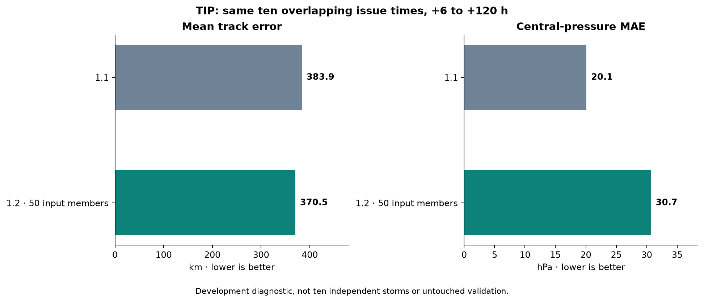
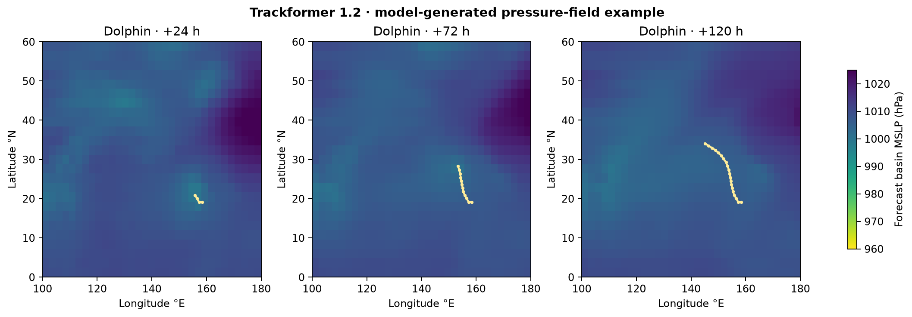

# Trackformer 1.2

Trackformer 1.2 is a **research-only Western Pacific tropical-cyclone forecast model**. It evolves a sea-level-pressure (MSLP) field and a moving storm-centred pressure core every six hours through +120 h. A track and central-pressure estimate are extracted from the evolving core, not independently drawn on top of a pressure image. The prior [Trackformer 1.1 release](https://github.com/yu314-coder/typhoon-predict/releases/tag/trackformer-1.1) remains available and unchanged.

**Not an operational warning system.** Do not use these forecasts for evacuation, aviation, maritime, or other safety-critical decisions. The public 1.2 name identifies one selected development checkpoint; a genuinely untouched storm-level holdout has not yet established generalization.

## What changed from 1.1

| | Trackformer 1.1 | Trackformer 1.2 |
| --- | --- | --- |
| Main representation | Observed history and weather features to track/intensity/structure outputs | Autoregressive basin MSLP plus storm-centred moving pressure core |
| Six-hour outputs | Track, maximum wind, central pressure, RMW, R34/R50/R64 | Track, central pressure, basin and regional MSLP; auxiliary maximum-wind scalar |
| Pressure-map capability | No native evolving MSLP forecast field in released model | Model-generated MSLP fields at every lead |
| Forecast horizon | +6 to +120 h | +6 to +120 h |
| Meaning of “50-member mean” | Not part of the 1.1 comparison | Same weights on 50 distinct, smoothly perturbed **causal input histories**; separately averaged routes, pressures and common-grid fields. Not 50 trained networks or learned latent members. |

The two models use different input pipelines. A direct chart is therefore a *forecast-output comparison on common cases and leads*, not a controlled architecture ablation.

## How the 1.2 model works

1. **Causal initialization.** Nine six-hour analyses ending at issue time provide eight basin channels on a 25×33 grid: MSLP, 500-hPa height, and 850/500/200-hPa winds. Where stored native detail exists, nine 121×121 regional MSLP patches supplement the coarse field. Static geography, current observed centre, recent motion, current intensity and masks are issue-time inputs. A compact pressure correction initializes the regional core from current observations; it is a reconstruction, not future weather.
2. **Environmental transport.** A convolutional recurrent state evolves the basin field. Estimated steering flow and a departure grid advect it, with learned pressure tendencies. Two pooled spatial scales feed a two-block transformer encoder; cross-attention conditions the environmental memory. Its output starts at zero so the added component initially matches its warm-start baseline.
3. **Moving pressure core.** A 65×65 storm-centred internal grid at approximately 20-km spacing moves with the storm. Its pressure anomaly is transported relative to the environmental flow and updated by learned tendencies. The displayed 121×121 regional field is a resampled composite; the moving core is authoritative for centre and central pressure.
4. **Coupled outputs.** A local low-pressure association within 300 km identifies the forecast centre. Central pressure is sampled from the predicted core **at that centre**. Maximum wind is an auxiliary scalar, not a resolved wind field or wind radii.
5. **Autoregression.** The transition runs 20 times for +6, +12, …, +120 h. Training combines basin-field, regional/core-field, track, central-pressure and auxiliary-wind losses, plus masked pressure-change and displacement losses. Future truth is a training/evaluation target only, never an inference input.

The implementation is in [`models/trackformer_1_2_field/`](models/trackformer_1_2_field/); its [`manifest.json`](models/trackformer_1_2_field/manifest.json) records exact grids, normalization, architecture and SHA-256 provenance. Internally the selected checkpoint came from experiment version `1.2.73`, epoch 4. The public model is **Trackformer 1.2**; that internal identifier is retained only for reproducibility.

## Saved comparison with 1.1

Both rows use the **same ten overlapping TIP issue times**, 1979-10-12 00 UTC through 1979-10-14 06 UTC, at six-hour leads through +120 h. Lower is better. The 1.2 row is the 50-input-member mean; 1.1 is its released prediction pipeline, so this is not a same-member-count experiment.

| TIP ten-start development diagnostic | 1.1 | 1.2, mean of 50 causal input members |
| --- | ---: | ---: |
| Mean track error | 383.9 km | **370.5 km** |
| Central-pressure MAE | **20.1 hPa** | 30.7 hPa |

The track gain is small (about 3.5%); central-pressure error is substantially worse. TIP's ten starts are one storm with overlapping forecasts, not ten independent holdout storms. They do **not** establish that 1.2 is better overall or resistant to overfitting.

The saved Dolphin example below uses 1.2's **forecast basin MSLP**, not a post-drawn or borrowed pressure map. It shows +24, +72 and +120 h fields with the extracted route. Trackformer 1.1 does not emit an equivalent evolving MSLP field, so no fake 1.1 field comparison is shown.

On a separate, repeatedly inspected 270-case development cohort (90 storms × three issues), the 1.2 mean-of-50 result was 714.4 km mean track error, 15.73 hPa central-pressure MAE and 2.54 hPa area-weighted regional MSLP MAE; **there is no directly matched 1.1 field score**. The TIP and 270-case results must not be mixed into a single ranking. See [evaluation notes](docs/trackformer_1_2_evaluation.md).

## Get the model and run it

- [GitHub release and source](https://github.com/yu314-coder/typhoon-predict/releases/tag/trackformer-1.2)
- [Hugging Face weights and model card](https://huggingface.co/euler314/typhoon-predict)
- [Input schema and inference instructions](models/trackformer_1_2_field/README.md)

The inference-only `weights.pt` is hosted in the release/Hugging Face model folder, **not committed to GitHub source**. The manifest records its SHA-256 and the original training-checkpoint SHA-256. The three source modules are copied unchanged from the verified training implementation. The root-level `trackformer_1_2.py` and older `examples/predict_trackformer_1_2.py` are legacy artifacts from a withdrawn, unrelated 1.2 candidate; **do not use them with these field weights**.

Only issue-time and earlier analyses are permitted. The prediction wrapper rejects future-dated history and unexpected input keys, but cannot certify an externally built packet's data provenance. The operator must verify source timestamps and training-only normalization. The included wrapper runs one unperturbed forecast; it does not reproduce the saved 50-member mean automatically.
