# Trackformer 1.2

**[Download 1.2: weights + code](https://github.com/yu314-coder/typhoon-predict/releases/download/trackformer-1.2/trackformer_1_2_field_20260929.tar.gz)** · **[Read the illustrated paper](paper/trackformer.pdf)** · **[Watch Fung-wong](https://yu314-coder.github.io/typhoon-predict/trackformer_1_2_fung_wong.mp4)** · **[Hugging Face model](https://huggingface.co/euler314/typhoon-predict)**

Release status: **1.2 research release**, not operational certification. The package contains the released 1.2 weights, inference code, input contract, completed 270-storm evaluation and illustrated paper. The original 1.1 release remains separate.

Trackformer 1.2 is a **research-only Western Pacific tropical-cyclone forecast model**. It evolves a sea-level-pressure (MSLP) field and a moving storm-centred pressure core every six hours through +120 h. A track and central-pressure estimate are extracted from the evolving core, not independently drawn on top of a pressure image. The prior [Trackformer 1.1 release](https://github.com/yu314-coder/typhoon-predict/releases/tag/trackformer-1.1) remains available and unchanged.

**Not an operational warning system.** Do not use these forecasts for evacuation, aviation, maritime, or other safety-critical decisions. The public 1.2 name identifies one selected development checkpoint; a genuinely untouched storm-level holdout has not yet established generalization.

## What changed from 1.1

| | Trackformer 1.1 | Trackformer 1.2 |
| --- | --- | --- |
| Main representation | Observed history and weather features to track/intensity/structure outputs | Autoregressive basin MSLP plus storm-centred moving pressure core |
| Six-hour outputs | Track, maximum wind, central pressure, RMW, R34/R50/R64 | Track, central pressure, basin and regional MSLP; auxiliary maximum-wind scalar |
| Pressure-map capability | No native evolving MSLP forecast field in released model | Model-generated MSLP fields at every lead |
| Forecast horizon | +6 to +120 h | +6 to +120 h |
| Meaning of “50-member mean” | Not part of the 1.1 comparison | Same weights on 50 distinct, smoothly perturbed **causal input histories**; separately averaged routes, pressures and common-grid fields. Not 50 trained networks or learned latent members. |

The two models use different input pipelines. A direct chart is therefore a *forecast-output comparison on common cases and leads*, not a controlled architecture ablation.

## How the 1.2 model works

1. **Causal initialization.** Nine six-hour analyses ending at issue time provide eight basin channels on a 25×33 grid: MSLP, 500-hPa height, and 850/500/200-hPa winds. Where stored native detail exists, nine 121×121 regional MSLP patches supplement the coarse field. Static geography, current observed centre, recent motion, current intensity and masks are issue-time inputs. A compact pressure correction initializes the regional core from current observations; it is a reconstruction, not future weather.
2. **Environmental transport.** A convolutional recurrent state evolves the basin field. Estimated steering flow and a departure grid advect it, with learned pressure tendencies. Two pooled spatial scales feed a two-block transformer encoder; cross-attention conditions the environmental memory. Its output starts at zero so the added component initially matches its warm-start baseline.
3. **Moving pressure core.** A 65×65 storm-centred internal grid at approximately 20-km spacing moves with the storm. Its pressure anomaly is transported relative to the environmental flow and updated by learned tendencies. The displayed 121×121 regional field is a resampled composite; the moving core is authoritative for centre and central pressure.
4. **Coupled outputs.** A local low-pressure association within 300 km identifies the forecast centre. Central pressure is sampled from the predicted core **at that centre**. Maximum wind is an auxiliary scalar, not a resolved wind field or wind radii.
5. **Autoregression.** The transition runs 20 times for +6, +12, …, +120 h. Training combines basin-field, regional/core-field, track, central-pressure and auxiliary-wind losses, plus masked pressure-change and displacement losses. Future truth is a training/evaluation target only, never an inference input.

The implementation is in [`models/trackformer_1_2_field/`](models/trackformer_1_2_field/); its [`manifest.json`](models/trackformer_1_2_field/manifest.json) records exact grids, normalization, architecture and SHA-256 provenance. Internally the selected checkpoint came from experiment version `1.2.73`, epoch 4. The public model is **Trackformer 1.2**; that internal identifier is retained only for reproducibility.

### Architecture at a glance

| Component | Released configuration |
| --- | --- |
| Trainable parameters | 21,452,595 |
| Input history | Nine analyses, −48 to 0 h; basin tensor 9 × 8 × 25 × 33 |
| Basin evolution network | Widths 72 / 144 / 288 / 432; residual depths 2 / 2 / 4 / 4 |
| Core evolution network | Widths 64 / 128 / 256 / 384; moving 65 × 65 pressure grid, 20-km spacing |
| Environmental attention | 134 pooled tokens; width 64; four heads; two Transformer blocks; 825 basin queries |
| Recurrent memory | 32 channels for each of basin and core |
| Geographic readout | Pressure-associated centre within 300 km; central pressure sampled at that centre |
| Five-day forecast | 20 autoregressive six-hour transitions; future observations excluded |

Grid spacing describes the representation, not independently demonstrated effective resolution. A mean of member centres is not necessarily the minimum of the displayed mean pressure field.

## Completed benchmark: 270 storms · 1,473 daily forecasts

One typhoon on one UTC day is one case. Each issue forecasts **+6 to +120 h**. We average lead errors within each issue, daily scores within each storm, then the **270 storm scores equally**. This prevents long-lived storms dominating the benchmark. All 1,473 cases finished on **29 September 2026, 08:22 UTC**, with every saved forecast SHA-256 verified.

| Equal-storm metric | 1.1 | 1.2 · mean of 50 | Preferred |
| --- | ---: | ---: | --- |
| Mean track error, +6 to +120 h | 798.4 km | **471.2 km** | Lower |
| Track error at +120 h | 1,646.4 km | **1,031.6 km** | Lower |
| Six-hour direction error | 51.58° | **34.96°** | Lower |
| Centred route-shape similarity | 0.7544 | **0.8837** | Higher |
| Geographic path similarity | 0.5345 | **0.6560** | Higher |
| Fréchet distance | 1,658.1 km | **1,045.8 km** | Lower |

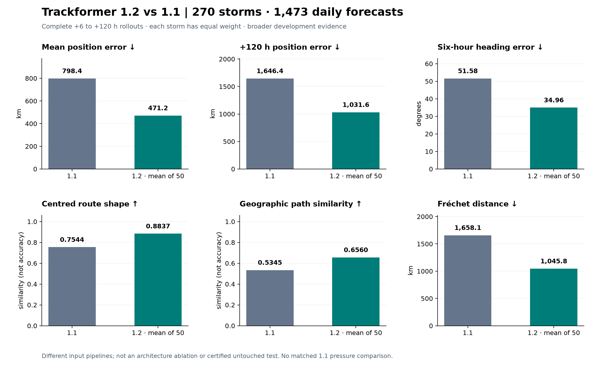

Mean track error is **41.0% lower** for 1.2 on this cohort. Direction, shape and geographic alignment remain separate measures, not a combined score. A shape score near one does not guarantee overlapping routes at matching times. The 1.2 forecasts are means of **50 distinct causal input perturbations**, not 50 independently trained networks. Forecast pipelines differ, so this is not an architecture ablation.

**Pressure coverage in the original track run:** 1.2 central-pressure MAE is **12.62 hPa over 40 storms with valid labels**; basin-area-weighted MSLP MAE is **2.72 hPa over 270 storms**. That original run did not save matched 1.1 intensity outputs. The new matched comparison below uses its own common masks; its scores are not interchangeable with this pressure-only score. Basin-wide error does not establish core-field accuracy.

**Limits:** the frozen cohort includes 40 recent storms and 230 historical storms from 1980–1999. It excludes this checkpoint's fitting/validation years, but has not been certified untouched across prior experiments. Historical hindcasts use retrospective analyses and a model trained on later years. Complete five-day labels are required, excluding short remaining lifetimes. No operational or no-overfitting claim follows.

[Final report and all storm scores](evaluation/daily_storm_final.json) · [Protocol](docs/daily_storm_benchmark.md) · [Frozen issues](evaluation/release_data/daily_storm_cohort.json) · [Reproduce chart](release_tools/plot_daily_storm_final.py)

**Reading route similarity:** direction error compares headings of common moving six-hour steps. Centred shape similarity removes translation and scale but preserves orientation; it does not establish geographic overlap. Path similarity also responds to displacement. Predicted and observed routes should align at the same valid times, so these metrics must be read alongside position error and unshifted route overlays.

## Matched wind, intensity and radius benchmark

**The same method as the track benchmark:** one forecast per typhoon-day; average valid +6, +12, …, +120 h errors within that daily issue; average daily scores within each typhoon; then average typhoons with **equal storm weight**. Per-lead charts use the same daily → storm hierarchy. Missing measurements stay missing, not zero error; curve comparisons keep the same valid times and do not shift or stretch either timeline.

The full frozen **270-storm / 1,473-day** plan was checked. The original 1.1 intensity pipeline can run on **134 daily starts from 40 storms** with the required valid current wind and pressure. The other **1,339 starts are explicitly unavailable** to this matched native comparison, not silently filled from later observations or dropped for poor predictions. This is not a 270-storm intensity result. All 134 real **50-member 1.2** replays completed on the Mac GPU; their means reproduce the original saved pressure forecasts exactly (maximum difference **0.0 hPa**), and every member and source hash passed verification. 1.1 retains its frozen primary, structure and gated temporal experts and original calibration; it is not falsely called a 50-member model.

| Equal-storm metric · lower is better | 1.1 | 1.2 · mean of 50 | Valid coverage |
| --- | ---: | ---: | --- |
| Wind MAE against USA 1-minute reference | 16.98 kt | 25.03 kt | 40 storms / 134 days |
| USA central-pressure MAE | 12.84 hPa | 12.55 hPa | 40 storms / 134 days |
| JMA central-pressure MAE | 13.53 hPa | 12.84 hPa | 40 storms / 134 days |
| Wind time-curve shape error | 0.271 | 0.385 | 40 storms / 131 days |
| USA pressure time-curve shape error | 0.276 | 0.336 | 40 storms / 131 days |
| JMA pressure time-curve shape error | 0.293 | 0.288 | 40 storms / 134 days |
| Wind six-hour trend-direction mismatch | 56.1% | 60.8% | 40 storms / 134 days |

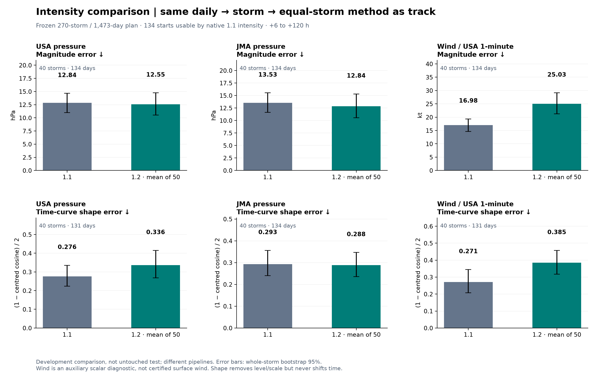

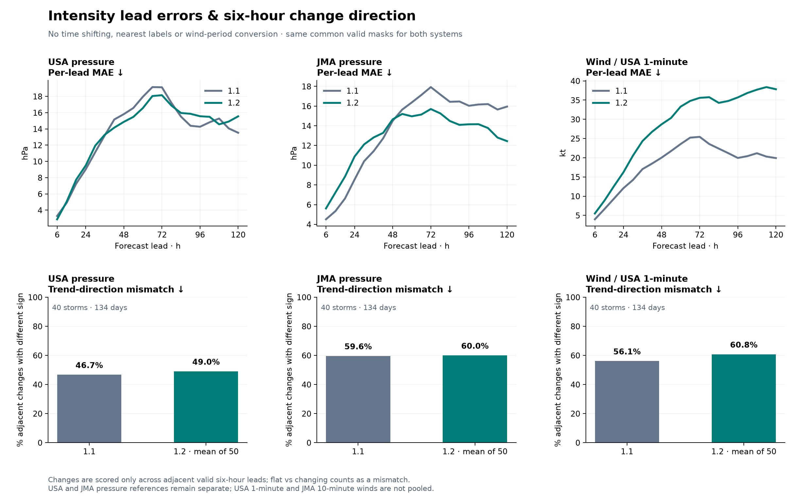

**Tradeoffs, not an overall win:** 1.2 has slightly lower mean pressure error, but its auxiliary wind is worse on magnitude and curve alignment. USA pressure at +120 h is also worse (**15.55 vs 13.52 hPa**), whereas JMA pressure at +120 h is better (**12.44 vs 15.95 hPa**). Agencies and forecast leads matter. The wind score is a diagnostic of 1.2's auxiliary scalar against a native one-minute reference, **not validation of a resolved or calibrated surface-wind product**; JMA's ten-minute wind is neither converted nor mixed into that score.

The time-curve shape error is **(1 − centred cosine similarity) / 2**, lower is better, at exact common UTC leads. It removes mean and amplitude, so it must be read with MAE; it does not prove intensity levels align. It requires at least six valid points and non-flat curves in both forecasts and truth. Trend-direction mismatch compares increasing / flat / decreasing changes over **adjacent valid six-hour steps**; no gap is bridged. The [full report](evaluation/intensity/intensity_final.json) also includes six-hour tendency MAE, all per-storm scores, coverage and paired differences. Error bars are 2,000 fixed-seed **whole-storm** bootstrap replicates, not independent resampling of overlapping days. These are development diagnostics, not a newly certified untouched holdout or an architecture ablation; the curve protocol is a versioned post-hoc descriptive addition, not a preregistered hypothesis test.

### Radius errors — matched definitions, not a fabricated 1.2 head

Native 1.1 RMW and **NE / SE / SW / NW maximum-extent R34/R50/R64** predictions are compared only with the same native USA definitions in IBTrACS. Observation radii in nautical miles are multiplied by **1.852** to obtain kilometres; no diameters, eye size, outer-isobar radius or JMA R30 are substituted. Valid reported zero wind-radius extents remain zero; missing reports and non-positive RMW remain unavailable. Radius lead/component errors are averaged within the daily issue, then daily → storm → equal storm, like track.

| Native radius MAE | 1.1 | Native 1.2 | Valid coverage |
| --- | ---: | --- | --- |
| RMW | 22.20 km | N/A — no radius head | 40 storms / 134 days |
| R34 quadrants | 60.93 km | N/A — no radius head | 35 storms / 124 days |
| R50 quadrants | 36.39 km | N/A — no radius head | 16 storms / 59 days |
| R64 quadrants | 26.78 km | N/A — no radius head | 12 storms / 45 days |

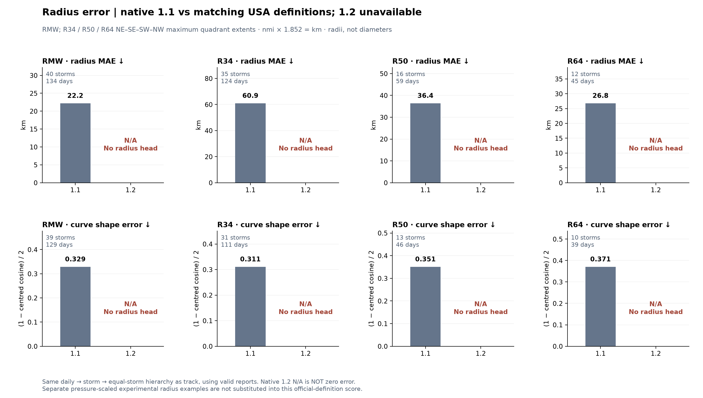

**N/A is not zero error or a model win.** The separate pressure-scaled radius candidate below is not inserted into these native model bars: its surface-wind height and averaging period are not validated, so its strict definition guard rejects an official-equivalent skill claim. USA RMW is not universally best-tracked. [Native field definitions](https://www.ncei.noaa.gov/sites/default/files/2025-09/IBTrACS_v04r01_column_documentation.pdf) · [Protocol and reproduction](docs/intensity_benchmark.md) · [Verification receipt](evaluation/intensity/verification.json).

### Four-storm wind, pressure and radius timelines

The plots retain native **USA one-minute** and **JMA ten-minute** winds as separate curves, plus observed pressure, RMW and each radius quadrant. A separate experimental algorithm uses the exact issue-time structure and each of **50 actual model pressure members**, then averages diagnosed member values—not a diagnosis of the mean map. Dashed RMW is **issue-time persistence**, not a forecast of changing eyewall size. Reference gaps remain gaps; the radius candidate is visibly labeled experimental.

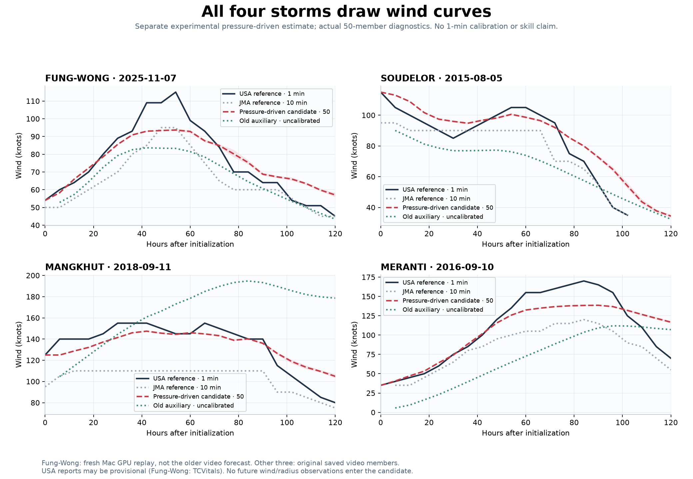

<details>
<summary>Fung-wong · issue 7 November 2025, 00 UTC</summary>

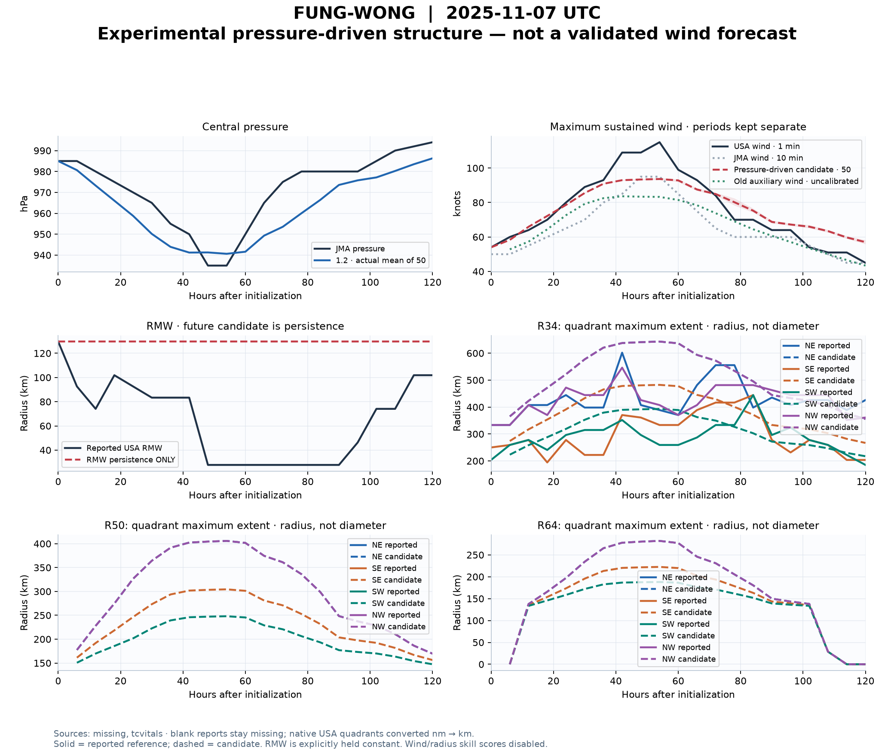

[Definitions, member proof and source hashes](evaluation/storm_structure/fung_wong_structure.json). This is a separately saved fresh replay; its pressure output is **not substituted into the older Fung-wong MP4**.

</details>

<details>
<summary>Soudelor · issue 5 August 2015, 00 UTC</summary>

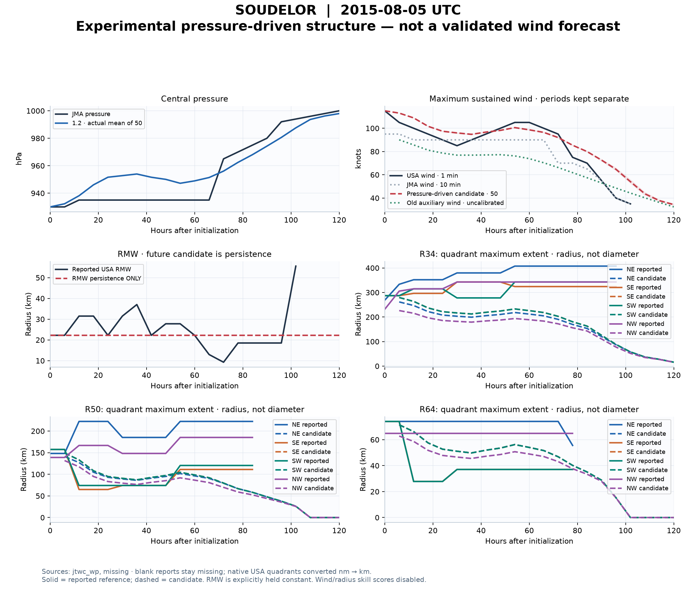

[Definitions and member proof](evaluation/storm_structure/soudelor_structure.json).

</details>

<details>
<summary>Mangkhut · issue 11 September 2018, 00 UTC</summary>

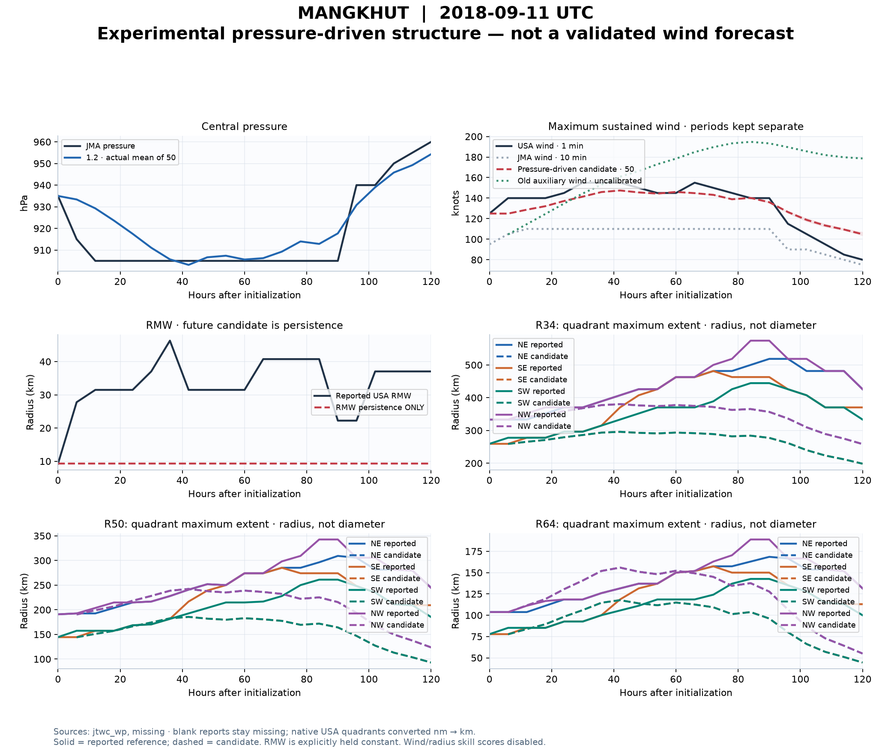

[Definitions and member proof](evaluation/storm_structure/mangkhut_structure.json).

</details>

<details>
<summary>Meranti · issue 10 September 2016, 00 UTC</summary>

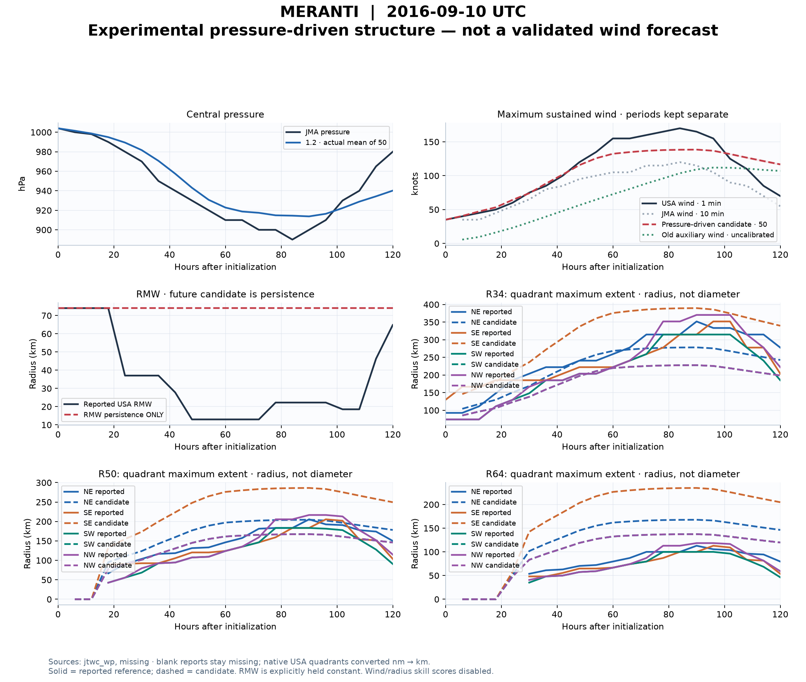

[Definitions and member proof](evaluation/storm_structure/meranti_structure.json).

</details>

[Experimental algorithm and limitations](release_tools/STORM_STRUCTURE_DIAGNOSTICS.md) · [Audit index](evaluation/storm_structure/index.json) · [History wind/intensity/radius graphs](https://trackformer-weatherlab.rudin-euler-8253.chatgpt.site/history). These selected examples are illustrations, not typical-skill or untouched-test claims. The History tab shows available observations for every browsable storm; forecasts and radius estimates are never invented to fill missing inputs.

## Fung-wong pressure forecast — MP4

[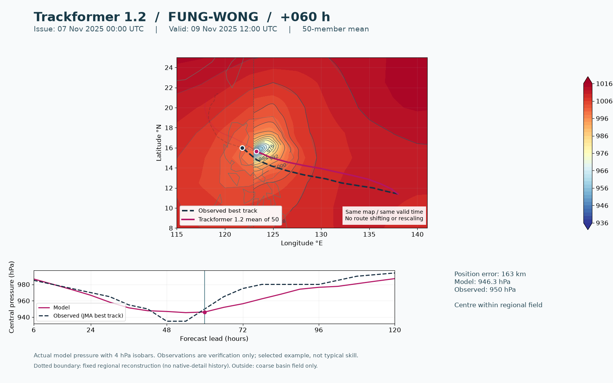](https://yu314-coder.github.io/typhoon-predict/trackformer_1_2_fung_wong.mp4)

**[Play or download the Fung-wong MP4](https://yu314-coder.github.io/typhoon-predict/trackformer_1_2_fung_wong.mp4)** · 23 seconds · +6 to +120 h · **50-member mean**. Click the preview above to play it; inline video playback depends on the Markdown host.

The forecast starts **7 November 2025 at 00 UTC**. The updated MP4 uses **blue for low pressure and red for high pressure**, with the unnecessary map grid and faint future-path overlays removed. Actual saved model-generated pressure with **4 hPa isobars** is shown alongside the mean forecast route and observed best track, at matching valid times and on the same geographic map. Neither route nor field is shifted or rescaled to improve alignment. The central-pressure timeline compares the forecast to **JMA best-track pressure from IBTrACS TOKYO_PRES**, not a JMA forecast.

This is the user-selected **Fung-wong route-and-pressure example**, not a claim of typical or untouched-test performance. The curves follow a similar broad path but do not perfectly overlap; timing and position differences remain. Central-pressure MAE is **7.36 hPa** across 20 valid labels, with an imperfect intensification and weakening cycle. For context, mean geographic position error is 130.9 km and +120 h error is 142.3 km; those distances alone do not establish route overlap. These scores use exact observed coordinates and great-circle distances, separately from the saved local-coordinate benchmark scores above.

Native-detail input history was unavailable; the regional pressure reconstruction uses 0.25° output sampling, not native resolution. **From +66 h the forecast centre is outside the fixed regional patch**, so only the saved coarse basin field is displayed there. The video labels this coverage limit; it does not invent an extended detailed core. Member-mean central pressure still comes from each model member's moving-core readout, not the minimum of the displayed mean map. [Data, source hashes and video provenance](evaluation/release_data/fung_wong_video.json).

## More historical pressure forecasts — MP4

Each film shows a **Western Pacific pressure overview**, a larger **unshifted forecast-versus-observed route close-up**, and a central-pressure comparison with JMA best track. All three were freshly forecast on the Mac GPU using the frozen **Trackformer 1.2** release and **50 distinct seeded input perturbations**. The displayed physical pressure fields, routes and central pressures are separately averaged over all 50 members. Each 23-second MP4 contains 20 genuine six-hour forecast states through **+120 h**, with blue lows, red highs and 4 hPa isobars; no interpolated forecast states.

| Soudelor (2015) | Mangkhut (2018) | Meranti (2016) |
| --- | --- | --- |
| [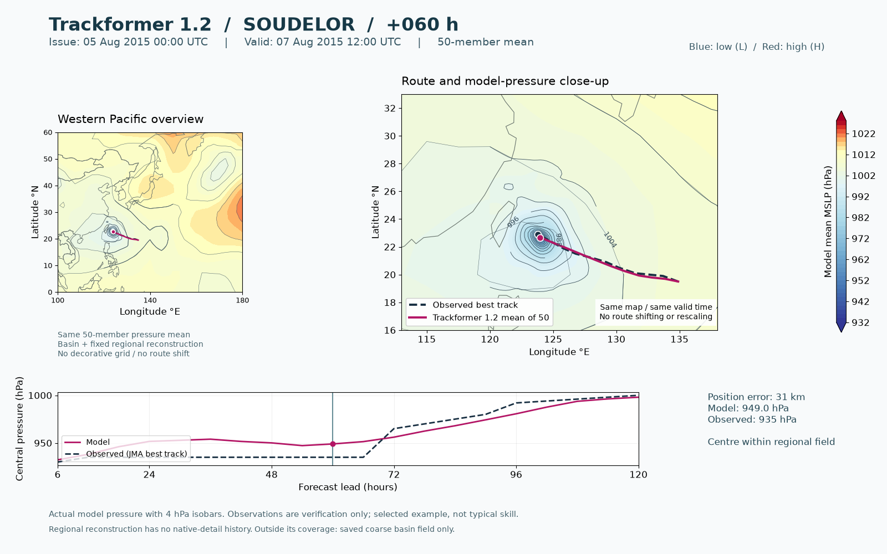](https://yu314-coder.github.io/typhoon-predict/trackformer_1_2_soudelor.mp4) | [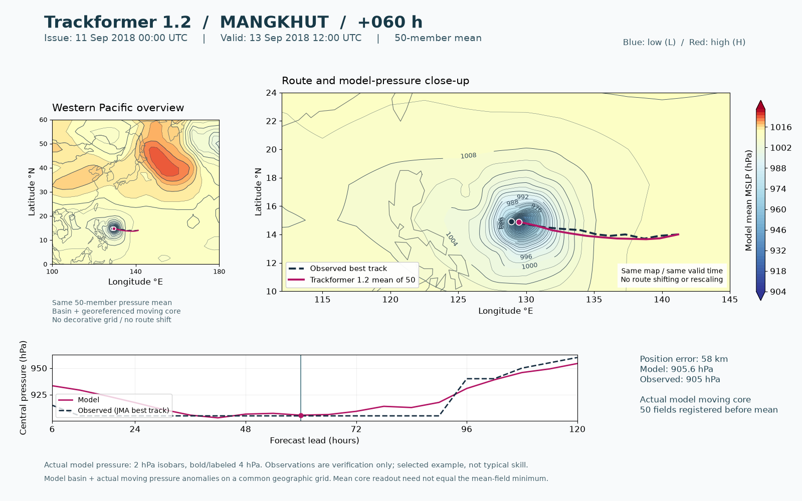](https://yu314-coder.github.io/typhoon-predict/trackformer_1_2_mangkhut.mp4) | [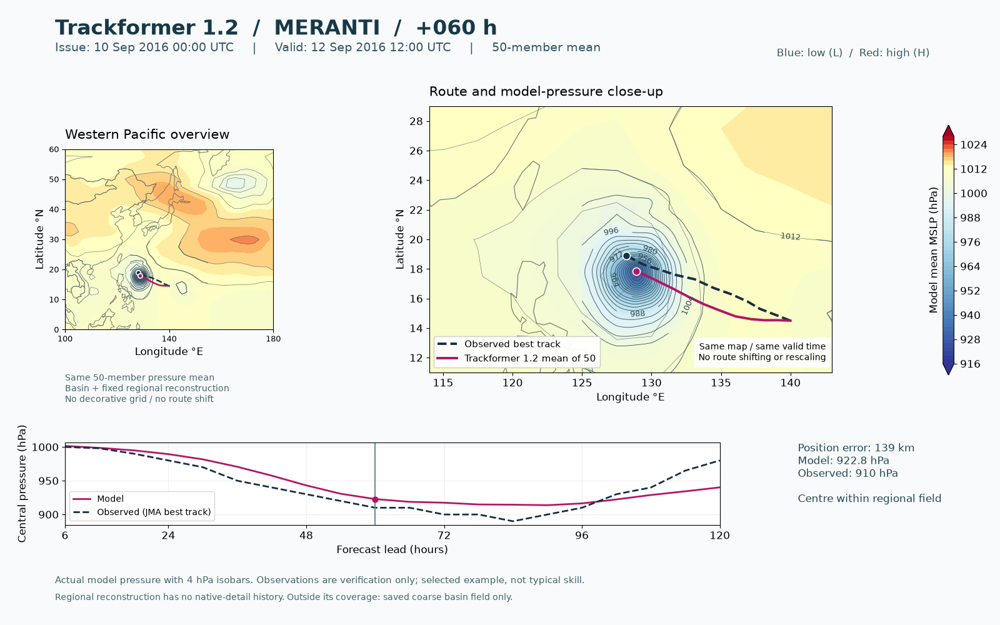](https://yu314-coder.github.io/typhoon-predict/trackformer_1_2_meranti.mp4) |
| Issue: **5 Aug 2015, 00 UTC** | Issue: **11 Sep 2018, 00 UTC** | Issue: **10 Sep 2016, 00 UTC** |
| [Play / download MP4](https://yu314-coder.github.io/typhoon-predict/trackformer_1_2_soudelor.mp4) · [Provenance](evaluation/release_data/soudelor_video.json) | [Play / download MP4](https://yu314-coder.github.io/typhoon-predict/trackformer_1_2_mangkhut.mp4) · [Provenance](evaluation/release_data/mangkhut_video.json) | [Play / download MP4](https://yu314-coder.github.io/typhoon-predict/trackformer_1_2_meranti.mp4) · [Provenance](evaluation/release_data/meranti_video.json) |

**These are calendar-selected historical development examples, not untouched tests or representative skill claims.** Their dates were fixed before inference, without choosing the lowest-error starts, but may overlap the checkpoint's fitting/validation years. Inputs are nine exact six-hour retrospective NCEP analyses through issue time, current intensity and past motion. Future observations are comparison labels only. Native-detail history is not supplied to these runs and remains masked; the regional reconstruction has 0.25° sampling, while outside that fixed patch only the 2.5° basin field is shown. Meranti's issue-time wind was missing and remains masked, not filled from future data. No wind-radii forecast is implied.

[50-member mean and MP4 audit](evaluation/release_data/historical_video50_verification.json) · [Mac GPU forecast preparation](release_tools/forecast_historical_video50_mac.py) · [Video renderer](release_tools/build_fung_wong_video.py)

### Illustrated technical paper

The **[Trackformer 1.2 technical paper (PDF)](paper/trackformer.pdf)** explains the input tensors, multiscale attention, recurrent basin transport, moving pressure core, centre association, objectives and 50-member means. It includes a **model-structure diagram**, **1.2-versus-1.1 benchmark bars and lead-error curves**, and the selected **Fung-wong route, central-pressure timeline and model-generated isobar map**. Development-data limitations, short-lead regressions and pressure failures are reported alongside improvements. [Editable, self-contained LaTeX source](paper/trackformer.tex) · [Figure reproduction utility](release_tools/build_paper_figures.py). Historical material is recoverable from Git history and the [1.1 release](https://github.com/yu314-coder/typhoon-predict/releases/tag/trackformer-1.1).

## Recent pressure forecast with isobars

The archived **Surigae forecast issued 27 September 2026 at 12:00 UTC** shows the model's regional pressure field at +6, +24 and +36 h. Thin lines are isobars every **4 hPa**, with selected labels every 12 hPa; magenta shows the forecast track and centre. Coastlines provide geographic context. These panels use the actual saved model values.

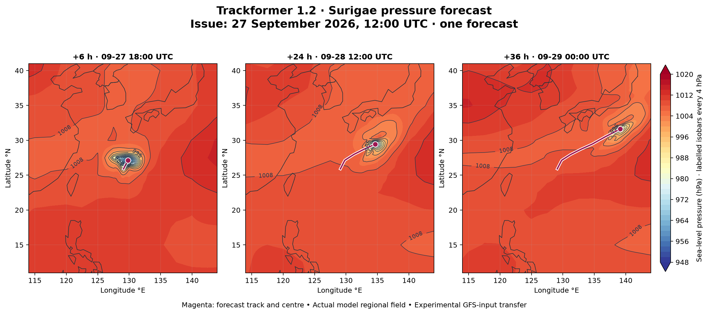

This recent example is **one deterministic forecast**, separate from the benchmark's mean of 50. Its input uses nine GFS analyses ending at 06 UTC, six hours before issue time; issue-time JMA central pressure was provided, while wind, prior motion and native regional history were unavailable. This transfer from the training data contract is experimental. The fixed regional map ends at 144°E; the selected leads keep the forecast centre inside it. The [pressure-field provenance](evaluation/release_data/surigae_provenance.json) records the input limitations and checkpoint hash.

## Get the model and run it

- [GitHub release and source](https://github.com/yu314-coder/typhoon-predict/releases/tag/trackformer-1.2)
- [Hugging Face weights and model card](https://huggingface.co/euler314/typhoon-predict)
- [Input schema and inference instructions](models/trackformer_1_2_field/README.md)

The inference-only `weights.pt` is hosted in the release/Hugging Face model folder, **not committed to GitHub source**. The manifest records its SHA-256 and the original training-checkpoint SHA-256. The three source modules are copied unchanged from the verified training implementation. Use **`models/trackformer_1_2_field/predict.py`** as the inference entry point. The withdrawn route/scalar candidate and its incompatible example have been removed from the current source tree.

### Run one forecast

Download and extract the complete package above, or obtain the source and place the [Hugging Face weights](https://huggingface.co/euler314/typhoon-predict/resolve/main/models/trackformer_1_2_field/weights.pt) at `models/trackformer_1_2_field/weights.pt`. In an environment with PyTorch and NumPy, prepare a normalized **causal issue packet** using the [input schema](models/trackformer_1_2_field/README.md), then run from the package root:

```bash
python models/trackformer_1_2_field/predict.py causal_issue_packet.npz forecast.npz --device mps
```

Use `--device cuda` for a compatible NVIDIA setup or `--device cpu` for CPU inference. `causal_issue_packet.npz` is a user-prepared input, not a bundled example or automatic live-data download. Output includes latitude/longitude track, central pressure and basin/regional MSLP arrays in hPa through +120 h. **This command produces one clean forecast, not the benchmark's 50-member mean.**

Released weight SHA-256: `db49f36e85a3766defc4c172746897a1f783705d1ce8e6f9dfb8e87ae1d902cb`.

Only issue-time and earlier analyses are permitted. The prediction wrapper rejects future-dated history and unexpected input keys, but cannot certify an externally built packet's data provenance. The operator must verify source timestamps and training-only normalization. The included wrapper runs one unperturbed forecast; it does not reproduce the saved 50-member mean automatically.

## Repository guide

| Folder | Contents |
| --- | --- |
| [`models/trackformer_1_2_field/`](models/trackformer_1_2_field/) | Current 1.2 model, inference wrapper and input/provenance contract |
| [`paper/`](paper/) | Illustrated architecture and development-evaluation paper: editable source and PDF |
| [`evaluation/`](evaluation/) | Benchmark charts, selected forecast previews, metrics and saved plot data |
| [`docs/`](docs/) | Evaluation protocols and published HTML/MP4 showcases |
| [`release_tools/`](release_tools/) | Reproduction scripts and weight-export utility |

The older 1.1 implementation, obsolete Colab notebook, withdrawn candidate, and superseded comparison assets are no longer mixed into the current source tree. Their history and the existing release tags remain intact; the current 1.1-versus-1.2 comparison data are retained. See the [cleanup record](docs/repository_layout.md).
